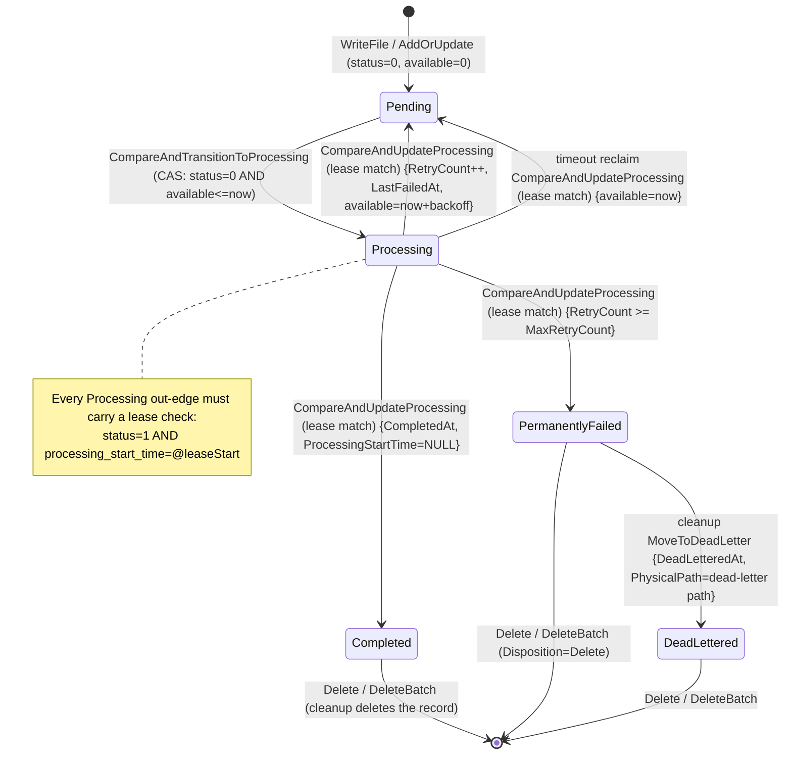

# Venue Storage Engine Migration Design: BadgerDB → SQLite (aligned with Locus v2.0.0)

This document is the **single design authority** for migrating Venue's metadata store and directory-quota store from BadgerDB to SQLite.
DDL, SQL, PRAGMAs, directory/file naming, state transitions, and error mapping are all specified concretely enough to implement directly.

- Language convention: English only. Identifiers, SQL, paths, and PRAGMA names stay in their original form.
- Evidence convention: Venue paths are repository-relative (for example `pkg/metadata/sqlite_backup.go:32`). Locus paths are written `locus/src/...` relative to the Locus reference checkout (for example `locus/src/Locus.Storage/Data/MetadataRepository.cs:678-687`). Locus v2.0.0, commit `292bd2cea7051ec277d97ca708443e668b40a2d4`, is the behavioral baseline.
- **The Locus v2.0.0 reference checkout is not part of this repository.** Every `locus/src/...` citation below is a read-only reference to that external checkout and is recorded here for provenance only.
- No machine-specific paths appear anywhere in this document. Every path is either repository-relative or a configured root such as `{metadataDirectory}`.

---

## Hard constraints

These four constraints are non-negotiable and gate every phase of the plan in §14.2.

### HC-1. Pure-Go driver, `CGO_ENABLED=0`

The SQLite integration **must** use a pure-Go driver: `modernc.org/sqlite` plus the standard library `database/sql`.
The module **must** build and test with `CGO_ENABLED=0`. A cgo-based SQLite binding (`github.com/mattn/go-sqlite3`) is **explicitly out of scope** and must not be introduced as a dependency, a build tag, or a fallback path.

Consequences that follow from this constraint:

- `go test -race` must not require a C toolchain.
- Cross-compilation must work from a single build configuration for Windows/Linux/macOS.
- `CGO_ENABLED=0 go build ./...` is part of **every** phase's gate list in §14.2, not just the dependency-introduction phase.

### HC-2. Build and test gate set

Every phase ends with the full gate set green, including the explicit pure-Go build:

```powershell
$env:CGO_ENABLED='0'; go build ./...
go build ./...
go test ./...
go test -race ./...
go vet ./...
golangci-lint run
```

### HC-3. No automatic data migration

BadgerDB → SQLite data migration is **not implemented** (§14.1). Old Badger directories are never read, never deleted, and never modified by the new code path.

### HC-4. Single runtime configuration model

`config.SqliteConfig` fully replaces `config.BadgerDBConfig` with **no** compatibility shim and **no** second runtime configuration model (§13.3).

---

## Table of contents

1. [Scope and decision summary](#1-scope-and-decision-summary)
2. [Evidence baseline](#2-evidence-baseline)
3. [Directory and file layout](#3-directory-and-file-layout)
4. [Driver choice](#4-driver-choice)
5. [Connection and concurrency strategy](#5-connection-and-concurrency-strategy)
6. [Logical schema: the files table](#6-logical-schema-the-files-table)
7. [Logical schema: the quotas table](#7-logical-schema-the-quotas-table)
8. [Timestamp encoding](#8-timestamp-encoding)
9. [Transactions and CAS](#9-transactions-and-cas)
10. [Queue order and pagination](#10-queue-order-and-pagination)
11. [Backup, restore, and corruption quarantine](#11-backup-restore-and-corruption-quarantine)
12. [Maintenance: Optimize / VACUUM / WAL](#12-maintenance-optimize--vacuum--wal)
13. [Configuration surface](#13-configuration-surface)
14. [Migration steps (no automatic data migration)](#14-migration-steps-no-automatic-data-migration)
15. [Performance and benchmark plan](#15-performance-and-benchmark-plan)
16. [Deliberate differences register](#16-deliberate-differences-register)
17. [Error mapping table](#17-error-mapping-table)
18. [Risks and open items (including decisions)](#18-risks-and-open-items-including-decisions)
19. [Appendix: executable SQL inventory](#19-appendix-executable-sql-inventory)

---

## 1. Scope and decision summary

### 1.1 Scope

**In scope**

- `pkg/metadata`: BadgerDB metadata projection → one SQLite database file per tenant.
- `pkg/quota`: BadgerDB directory-quota repository → one SQLite database file per tenant (aligned with Locus's `quotas.db`).
- `config` / `viperconfig` / `venue-config-example.yaml`: `BadgerDBConfig` → `SqliteConfig`.
- `venue.go` wiring, startup and shutdown, health-check path derivation.
- Metadata recoverability on SQLite: `VACUUM INTO` online backups + file-level restore.
- Benchmarks and performance thresholds.

**Explicitly out of scope**

- **No automatic BadgerDB → SQLite data migration** (§14).
- No change to the `MetadataRepository` / `DirectoryQuotaRepository` / `StatusPageReader` method signatures in `pkg/core`.
- No change to the business logic of `pkg/scheduler`, `pkg/cleanup`, `pkg/pool`, or `pkg/recovery` (they depend only on `core` interfaces).
- No SQLite `metadata_json` column, and none of Locus's write-behind queue / per-event journal (§16 D4).
- No cgo-based SQLite binding (§ Hard constraints HC-1).

### 1.2 Decision summary

| # | Decision | Rationale / note |
| --- | --- | --- |
| D-01 | Metadata layout: `{metadataDirectory}/{tenantId}/metadata.db`, one file per tenant | Locus `locus/src/Locus.Storage/Data/MetadataRepository.cs:678-687` |
| D-02 | Quota layout: `{quotaDirectory}/{tenantId}/quotas.db`, one file per tenant | Locus `locus/src/Locus.Storage/Data/DirectoryQuotaRepository.cs:250-259` |
| D-03 | Driver: `modernc.org/sqlite` (pure Go, no cgo) + standard library `database/sql`; version pinned to v1.59.0 | §4; offline introduction verified (§2.3, R8) |
| D-04 | Timestamp physical encoding: `INTEGER` Unix nanoseconds (UTC), logical semantics aligned with Locus | §8; Locus stores TEXT `ToString("O")` (`MetadataRepository.cs:4706`) |
| D-05 | Connection strategy: one `*sql.DB` per tenant, `SetMaxOpenConns(1)`, PRAGMAs aligned with `SqliteOptions.BuildPragmaSql()` | Locus `locus/src/Locus.Core/Models/SqliteOptions.cs:60-70,88-105` |
| D-06 | CAS: conditional `UPDATE` + `RowsAffected` decision, failures mapped to `core.ErrFileNotClaimable` / `core.ErrProcessingLeaseMismatch` | §9; corresponds to `core/interfaces.go:541-556` |
| D-07 | Pagination: keyset pagination on `ORDER BY available_for_processing_at, created_at, file_key`; cursor is base64url of a fixed-width opaque binary payload | §10; `core/interfaces.go:474-502` |
| D-08 | Backup: one `VACUUM INTO` backup file per tenant + `PRAGMA integrity_check`; restore = put the file back offline | §11 |
| D-09 | Backup directory expands one level per tenant: `{backupDirectory}/{tenantId}/metadata.<yyyyMMddTHHmmssZ>.bak` | §11.3; file naming follows `venue_metadata_backup.go` |
| D-10 | No automatic data migration; breaking change requiring downtime plus manual export/rebuild | §14 |
| D-11 | `config.BadgerDBConfig` is replaced wholesale by `config.SqliteConfig` (key `sqliteOptions`), with no deprecated alias | §13.3; `AGENTS.md` forbids a second runtime configuration model |
| D-12 | A single `core.MetadataRepository` facade holds `map[tenantId]*tenantDatabase`; tenant files are opened lazily on first access | §3.4; `venue.go:217` constructs exactly one repository instance |
| D-13 | `files` keeps neither Locus's `metadata_json` nor `delete_succeeded_at` | §6.4; Venue's model has no corresponding fields and SQLite can add columns online later |
| D-14 | `quotas.enabled` DDL default is `DEFAULT 0`, not Locus's `DEFAULT 1` | §7.4; matches Venue's domain default (`Enabled=false` on a new quota row); the insert path always binds the value explicitly |
| D-15 | `available_for_processing_at` keeps the `INTEGER NOT NULL DEFAULT 0` sentinel (no NULL) | §8.3; keeps claim range scans index-only |
| D-16 | Claim failure classification keeps the in-transaction probe SELECT plus a conditional UPDATE with `RowsAffected`; no `UPDATE ... RETURNING` | §9.3; the write lock held by `BEGIN IMMEDIATE` makes the classification race-free |
| D-17 | `config.BadgerDBConfig` → `config.SqliteConfig` with no compatibility shim and no second runtime configuration model | §13.3 |
| D-18 | Health checks stay structural (SQLite file header plus size; never open the database) | §18.3 Q6; avoids lock interaction and per-tenant open cost |
| D-19 | Paging cursors are opaque, valid only for the lifetime of one scan, and not compatible across engines or versions | §10.4 |
| D-20 | Per-tenant backups mean different tenants can have different recovery instants within one cycle; accepted and documented | §11.6; the `core.MetadataBackupService` godoc narrows "as of the backup instant" to "as of that tenant's backup instant" |
| D-21 | `MetadataBackupService.Backup(ctx, io.Writer) (since uint64, err error)` is kept so `Venue.BackupMetadata` / `RestoreMetadata` keep working | §11.1; the stream is a zip container holding one SQLite backup file per tenant, and `since` is always 0 for this engine |

---

## 2. Evidence baseline

### 2.1 Key Venue facts

| Fact | Evidence |
| --- | --- |
| The whole runtime constructs exactly **one** metadata repository instance (shared across all tenants); the tenant travels as a method parameter | `venue.go:211-221`: `metadata.NewBadgerMetadataRepository(metadataOptions)`; every method in `core/interfaces.go:505-566` takes `tenantID` |
| The current BadgerDB layout uses a single logical tenant segment `"shared"` | `venue.go:68-71` (`sharedMetadataTenantID = "shared"`), `venue.go:568` |
| Current metadata physical directory: `{metadataDirectory}/shared/metadata` | `venue.go:568`; same source for health checks `pkg/health/database_health_checker.go:18-22,118` |
| Current quota physical directory: `{quotaDirectory}/quota` | `pkg/quota/directory_quota_repository.go:122`; `venue.go:569` |
| `FileMetadata` field set (including Venue-specific fields) | `pkg/core/models.go:213-245` |
| Status enum values 0..7 are numerically compatible with Locus | `pkg/core/models.go:56-94` |
| Availability comparison is **inclusive** (`available <= now` is claimable) | `pkg/metadata/badger_repository.go:912` (`!AvailableForProcessingAt.After(now)`), `:1079` (rejects only when `time.Now().Before(*available)`) |
| Status index key = `(available, created, fileKey)`; NULL availability uses the sentinel `0000-00-00T00:00:00.000000000Z` | `pkg/metadata/migration.go:24-29,279-287` |
| Availability times use **fixed-width** TEXT because variable-length fractional digits break lexicographic order | `pkg/metadata/migration.go:20-23` |
| CAS failure classification separates `ErrFileNotClaimable` (contention) from `ErrDatabaseError` (infrastructure) | `pkg/core/errors.go:66-76`, `pkg/metadata/badger_repository.go:1114-1127` |
| Lease-mismatch errors carry the actual status and the actual lease start | `pkg/core/errors.go:78-115`, `pkg/metadata/badger_repository.go:1256-1272` |
| Releasing the same lease twice is an idempotent success (marked by `ReleasedProcessingStartTimeUTC`) | `pkg/core/models.go:230-234`, `pkg/metadata/badger_repository.go:1188-1202` |
| Pagination contract: `MetadataPage{Records, NextCursor}`; an empty `NextCursor` means the scan is complete | `pkg/core/interfaces.go:474-502` |
| Cursor encoding: base64url (RawURLEncoding) opaque token | `pkg/metadata/status_page.go:149-169` |
| Cleanup/recovery read pages through the optional `StatusPageReader` capability | `venue.go:617-655`, `pkg/cleanup/cleanup_service.go:224-226` |
| Backup capability: `core.MetadataBackupService.Backup(ctx, w) (since uint64, err error)` | `pkg/core/interfaces.go:355-369` |
| Backup file naming and timestamp layout: `metadata.<yyyyMMddTHHmmssZ>.bak`, staging `.tmp` | `venue_metadata_backup.go` (`metadataBackupFileName`, `freeBackupPath`) |
| Backup retention scans the per-tenant backup tree | `venue_metadata_backup.go` (`MetadataBackupService.prune`) |
| Quarantine semantics: rename to `<path>.corrupted.<UTC layout>` (no colons, for Windows) | `pkg/metadata/corrupted_database.go:20-30,192-217` |
| Default quarantine retention is 72h; a negative value disables pruning | `pkg/metadata/corrupted_database.go:15-18,161-167` |
| `RecoverCorruptedDatabase` / `CorruptedDatabaseRetention` / `BackupDirectory` / `BackupInterval` / `BackupRetention` / `AutoRestoreFromBackup` currently all live on `BadgerDBConfig` | `config/config.go:84-123`, `config/fluent.go:584-610` |
| Default value locations | `config/config.go:497-512` (including `BackupInterval: 1h`, `BackupRetention: 7*24h`, `CorruptedDatabaseRetention: 72h`) |
| BadgerDB validation rules (non-negative retention, auto-restore requires a backup directory) | `config/config.go:999-1030` |
| Viper default binding `badgerDBOptions.*` | `viperconfig/viper.go:96-98` |
| Directory quota DDL/default: a new quota is `Enabled=false, MaxCount=0` | `pkg/quota/directory_quota_repository.go:203-210` |
| The quota manager mutexes per (tenant, directory) via an FNV shard | `pkg/quota/directory_quota_manager.go:191-206` |
| Cache writes are monotonically protected by `UpdatedAt` (an older version must not overwrite a newer one) | `pkg/metadata/cache.go:75-101` |
| Tenant IDs must be a single path segment (separators, device names, leading dots, etc. are rejected) | `pkg/core/tenantid.go:25-99` |
| Tenant metadata JSON lives at `{metadataDirectory}/.locus/tenants/<id>.json` | `pkg/tenant/manager.go:88-91` |
| Tenant storage paths are recorded as `{metadataDirectory}/<tenantId>` | `pkg/tenant/manager.go:256,327` |
| The cleanup service calls `metadataRepo.Optimize` / `dirQuotaRepo.Optimize` | `pkg/cleanup/cleanup_service.go:881-887` |
| System benchmarks initialize through the public entry point `venue.NewVenue(*config.Config)` | `test/benchmark/system_bench_test.go:25-65` |
| Repository-level benchmark function inventory (names must be reused after migration so results are directly comparable) | `pkg/metadata/badger_repository_bench_test.go:19,36,60,81,105,133,164,186,209,233,261` |
| The scheduler comment claims a strict "earlier than now" claim rule, inconsistent with the implementation (inclusive) | `pkg/scheduler/file_scheduler.go:496-500` vs `pkg/metadata/badger_repository.go:912` |

### 2.2 Key Locus facts

| Fact | Evidence |
| --- | --- |
| Metadata database path `{metadataDirectory}/{tenantId}/metadata.db` | `locus/src/Locus.Storage/Data/MetadataRepository.cs:678-687` |
| One `Lazy<SqliteConnection>` per tenant, `LazyThreadSafetyMode.ExecutionAndPublication` | `MetadataRepository.cs:80,594-676` |
| `files` table DDL and its 8 indexes | `MetadataRepository.cs:559-588` |
| Connection string `Mode=ReadWriteCreate;Pooling=False`, one long-lived connection per tenant | `locus/src/Locus.Core/Models/SqliteOptions.cs:60-70` |
| PRAGMA initialization SQL (journal_mode / synchronous / cache_size / busy_timeout / foreign_keys=OFF / temp_store=MEMORY) | `SqliteOptions.cs:88-105` |
| journal mode / synchronous whitelists | `SqliteOptions.cs:72-78` |
| `CheckpointAfterBatch` → `PRAGMA wal_checkpoint(PASSIVE)` | `SqliteOptions.cs:44-53`; `MetadataRepository.cs:4585-4600` |
| PRAGMAs run before DDL when a connection is opened | `MetadataRepository.cs:740-763`; `DirectoryQuotaRepository.cs:300-336` |
| `files` upsert (`ON CONFLICT(file_key) DO UPDATE`) | `MetadataRepository.cs:4658-4720` |
| Conditional delete (CAS delete): status + timestamp conditions + `ExecuteNonQuery()>0` | `MetadataRepository.cs:1946-1968,1998-2019` |
| Status query ordered by `created_at, file_key` | `MetadataRepository.cs:2802-2805` |
| `completed_at` / `last_failed_at` time-window queries (ordered + LIMIT) | `MetadataRepository.cs:2758-2785` |
| The Pending query filters availability in memory (it cannot be bounded in SQL) | `MetadataRepository.cs:819-833,907-919` |
| Startup loads only hot statuses (Processing / Failed / Pending), streaming in batches | `MetadataRepository.cs:777-856` |
| VACUUM evicts that tenant's connection first (`Pooling=False` makes the handle releasable) | `MetadataRepository.cs:3700-3761` |
| Tenant directory enumeration plus a snapshot cache (avoids rescanning the directory every round) | `MetadataRepository.cs:3763-3806` |
| Timestamps written as TEXT `ToString("O")` (ISO-8601, variable fractional digits) | `MetadataRepository.cs:4706-4715` |
| Reads tolerate non-ISO values and fall back to epoch when parsing fails | `locus/src/Locus.Storage/Data/FileMetadataRow.cs:65-91` |
| The `metadata_json` column stores a `Dictionary<string,string>` | `FileMetadataRow.cs:34,93-96`, `MetadataRepository.cs:4718` |
| `quotas` table DDL + `idx_quotas_enabled` | `locus/src/Locus.Storage/Data/DirectoryQuotaRepository.cs:124-133` |
| Quota database path `{quotaDirectory}/{tenantId}/quotas.db` | `DirectoryQuotaRepository.cs:250-259` |
| Quota upsert (`ON CONFLICT(directory_path) DO UPDATE`, absolute counts) | `DirectoryQuotaRepository.cs:860-897` |
| Quota startup loads every row into memory (`buffered:false`, streaming) | `DirectoryQuotaRepository.cs:338-358` |
| Quota manager: reservation + projected dual counting, a per (tenant,dir) semaphore | `locus/src/Locus.Storage/DirectoryQuotaManager.cs:19-63,346-403` |
| Corruption handling: copy `{dbPath}.corrupted.{yyyyMMddHHmmss}` aside, then delete the database and its sidecars | `DirectoryQuotaRepository.cs:191-215,420-430` |
| Corrupted-backup pruning is the background cleanup service's job | `locus/src/Locus.Storage/StorageCleanupService.cs:2498-2556` |
| `PRAGMA integrity_check(1)` is used for the health verdict | `locus/src/Locus.Storage/Data/DatabaseRecoveryService.cs:88-100` |
| Integrity checks use a separate `Mode=ReadOnly;Pooling=False` connection; the verdict is that the scalar result equals `"ok"`; a read-only connection must not join the shared cache (otherwise concurrent writes cause spurious `SQLITE_READONLY`(8)) | `DatabaseRecoveryService.cs:72-105` (especially `:79-85,92-102`) |
| Corruption fingerprints: `SQLITE_CORRUPT`(11) / `SQLITE_NOTADB`(26) / `SQLITE_IOERR`(10); `SQLITE_BUSY`(5) / `SQLITE_LOCKED`(6) are only transient locks and do not count as corruption | `DatabaseRecoveryService.cs:106-124` |
| Recovery prefers rebuilding from the journal and only scans physical files if that fails | `DatabaseRecoveryService.cs:185,533-563` |
| One database file per tenant means the repository must be able to enumerate "known tenants" | `MetadataRepository.cs:3763-3785` |

### 2.3 Dependency availability facts (read-only inspection and an offline probe)

**Repository requirements and driver capabilities**

| Fact | Evidence |
| --- | --- |
| `go.sum` currently has **no** `modernc` entry (first introduction requires an offline `go mod tidy`) | zero `modernc` matches in `go.sum` |
| The repository `go.mod` declares `go 1.26.0`; `modernc.org/sqlite v1.59.0` requires `go >= 1.25.0` | `go.mod:3` |
| v1.59.0 dependencies: `modernc.org/libc v1.75.7`, `modernc.org/mathutil v1.7.1`, `modernc.org/fileutil v1.4.0`, `golang.org/x/sys v0.47.0`, `github.com/google/pprof` | `modernc.org/sqlite` v1.59.0 module metadata (`go.mod` requires block) |
| Transitive dependencies include `modernc.org/memory`, `github.com/ncruces/go-strftime`, `github.com/mattn/go-isatty`, `github.com/remyoudompheng/bigfft`, `github.com/dustin/go-humanize` | `modernc.org/sqlite` v1.59.0 module graph |
| The driver DSN supports `_busy_timeout/_timeout`, `_journal_mode/_journal`, `_synchronous/_sync`, `_foreign_keys/_fk`, `_txlock` (deferred/immediate/exclusive), and repeatable `_pragma=name(value)`; these shorthand value whitelists match Locus exactly | `modernc.org/sqlite` v1.59.0 `sqlite.go:307-391`; `driver.go:92-128,170-175` |
| The driver supports `_time_integer_format` (unix/unix_milli/unix_micro/unix_nano) and `_inttotime` | `modernc.org/sqlite` v1.59.0 `sqlite.go:365-400` |

**Dependency-availability risk R8: verified result**

A standalone probe module using `modernc.org/sqlite` v1.59.0 was built and run offline with the module proxy disabled. The verification is complete and the previous "not yet verified" status for R8 no longer applies.

Exact commands (no machine-specific path appears in any of them):

```powershell
# Fully offline: the module proxy is disabled and only the local module cache is consulted.
$env:GOPROXY='off'; $env:GOSUMDB='off'; $env:GOFLAGS='-mod=mod'
go mod tidy

# Build and run the probe: create a WAL-configured database, create a table,
# insert one row, read it back, and report the engine version.
$env:CGO_ENABLED='0'; go build ./...
go run .
```

Verified outcomes:

| Claim | Result |
| --- | --- |
| `go mod tidy` resolves the full `modernc.org/sqlite` v1.59.0 dependency graph offline with `GOPROXY=off` and `GOSUMDB=off` | succeeded |
| The probe builds with cgo disabled | succeeded (`CGO_ENABLED=0`) |
| A WAL-configured database can create a table, insert a row, and read it back | succeeded |
| Reported engine version | SQLite 3.53.4 |

Consequences: phase 0 (§14.2) is no longer blocked on dependency availability; the pinned version is `v1.59.0`; and the repo's `go.sum` still must be completed by `go mod tidy` during phase 0 because it has no `modernc` entry yet.

---

## 3. Directory and file layout

### 3.1 Target layout

```text
{metadataDirectory}/                                  # config.Config.MetadataDirectory (config/config.go:43)
    .locus/tenants/{tenantId}.json                    # tenant metadata JSON (unchanged, pkg/tenant/manager.go:88-91)
    {tenantId}/                                       # tenant directory (unchanged, pkg/tenant/manager.go:256)
        metadata.db                                   # SQLite main database file
        metadata.db-wal                               # WAL sidecar (present when journal_mode=WAL)
        metadata.db-shm                               # shared-memory sidecar (present with WAL)
        metadata.db.corrupted.<yyyyMMddTHHmmssZ>      # corruption quarantine copy (file level, not directory level)
        metadata.db.corrupted.<stamp>.1               # sequence suffix on same-second collision (corrupted_database.go:192-217 rules)

{quotaDirectory}/                                     # config.Config.QuotaDirectory (config/config.go:44)
    {tenantId}/
        quotas.db
        quotas.db-wal
        quotas.db-shm
        quotas.db.corrupted.<yyyyMMddTHHmmssZ>

{backupDirectory}/                                    # config.SqliteConfig.BackupDirectory
    {tenantId}/
        metadata.<yyyyMMddTHHmmssZ>.bak               # VACUUM INTO output (a complete, openable SQLite file)
        metadata.<yyyyMMddTHHmmssZ>.bak.tmp           # in-progress staging file (backup.go:30)
        metadata.<yyyyMMddTHHmmssZ>.<n>.bak           # same-second collision sequence (backup.go:389-408)
```

### 3.2 Differences from the current layout (breaking)

| Item | Before migration | After migration |
| --- | --- | --- |
| Metadata | `{metadataDirectory}/shared/metadata/` (BadgerDB directory: MANIFEST/KEYREGISTRY/*.vlog/*.sst/*.mem) | `{metadataDirectory}/{tenantId}/metadata.db` |
| Quota | `{quotaDirectory}/quota/` (BadgerDB directory) | `{quotaDirectory}/{tenantId}/quotas.db` |
| Health-check derivation | `{root}/shared/metadata`, `{root}/quota` (`pkg/health/database_health_checker.go:15-26,118,128`) | per-tenant directory enumeration + `metadata.db` / `quotas.db` |
| Backup | `{backupDirectory}/metadata.<stamp>.bak` (single file stream) | `{backupDirectory}/{tenantId}/metadata.<stamp>.bak` (one file per tenant) |

**The old Badger directories are never read in the new layout**: after an upgrade, `{metadataDirectory}/shared/metadata/` and `{quotaDirectory}/quota/` are left exactly as they are (**never deleted automatically**); operators must handle them per §14.

### 3.3 Tenant directory enumeration

The implementation needs a "known tenant set" to support `Optimize` / full-set backup / health checks:

1. Tenants that currently have an open handle in memory (authoritative and up to date);
2. A snapshot of the first-level subdirectory names under `{metadataDirectory}` (`os.ReadDir`, with a TTL cache, default 30s).

The Locus equivalent: `MetadataRepository.cs:3763-3805` (`GetAllKnownTenantIds` = in-memory tenants ∪ directory snapshot, the snapshot guarded by `TenantDirectoryCacheTicks`).
Venue-side constraints:

- Only directory names that satisfy `core.ValidateTenantID` count as tenants (`pkg/core/tenantid.go:40`); `.locus` is skipped (a leading dot is rejected by `ValidateTenantID`, `pkg/core/tenantid.go:69-71`);
- Enumeration reads directory names only and **never opens** database files (to avoid a handle explosion at startup, see §15.4).

### 3.4 Single facade + per-tenant handles

`venue.go:217` constructs exactly **one** `core.MetadataRepository`, while the layout is one file per tenant. The implementation shape is therefore fixed:

```go
// pkg/metadata/sqlite_repository.go
type SQLiteMetadataRepository struct {
    dataPath    string
    sqlite      sqliteSettings          // validated snapshot of PRAGMA/connection parameters
    mu          sync.RWMutex
    closed      bool
    closeOnce   sync.Once
    closeErr    error
    databases   map[string]*tenantDatabase  // guarded by mu
    cache       *metadataCache              // reuses pkg/metadata/cache.go
    // path and policy snapshots needed for backup/restore/quarantine
    backupDirectory string
    backupRetention time.Duration
    autoRestore     bool
    corruptRecover  bool
    corruptRetention time.Duration
    logging         *logging.Runtime
    statistics      core.StatisticsRecorder
    now             func() time.Time        // injectable for tests
}

type tenantDatabase struct {
    tenantID string
    path     string          // {dataPath}/{tenantID}/metadata.db
    db       *sql.DB         // SetMaxOpenConns(1)
    mu       sync.Mutex      // serializes this tenant's transactions (single writer together with maxOpenConns(1))
}
```

Invariants:

- A `tenantDatabase` serves exactly one `tenantID`; any write where `metadata.TenantID != handle.tenantID` is rejected with `ErrInvalidArgument`, mirroring Locus's projection-batch validation `MetadataRepository.cs:1340-1341` and `ValidateUpsertMetadata`.
- Every SQL statement carries a `tenant_id = @tenant` predicate (defense in depth, see §6.5).
- **Every statement of an open transaction must use that same `*sql.Tx`**; never acquire a second connection from `*sql.DB` inside a transaction (under `SetMaxOpenConns(1)` that self-deadlocks).

---

## 4. Driver choice

### 4.1 Decision

Use `modernc.org/sqlite` (pure-Go implementation, no cgo) plus the standard library `database/sql`.

```go
import (
    "database/sql"

    _ "modernc.org/sqlite" // registers the driver name "sqlite"
)
```

`go.mod` target:

```text
require modernc.org/sqlite v1.59.0
```

### 4.2 Reasons

| Reason | Explanation |
| --- | --- |
| No cgo | A pure-Go translation of SQLite; builds with `CGO_ENABLED=0`; `go test -race` needs no C toolchain; no gcc on Windows |
| Cross-platform consistency | One build configuration covers Windows/Linux/macOS |
| Offline availability | The module and its whole direct/transitive dependency graph resolve offline; verified by an actual probe build (§2.3), so `go mod tidy` plus a build completes with the module proxy disabled |
| DSN capability covers the requirements | `_journal_mode` / `_synchronous` / `_busy_timeout` / `_foreign_keys` / `_txlock=immediate` / repeated `_pragma`, with value whitelists matching Locus (`SqliteOptions.cs:74-78`) |
| Actively maintained | The design pins v1.59.0 (the newer libc 1.75.7 fix set) |

### 4.3 Alternatives and trade-offs

| Option | Pros | Cons | Verdict |
| --- | --- | --- | --- |
| `github.com/mattn/go-sqlite3` | Widest ecosystem, best performance under cgo, PRAGMA behavior 1:1 with the C library | **Requires cgo**: cross-compilation and `CGO_ENABLED=0` fail; Windows needs MSYS2/gcc; the CI matrix grows; `-race` combined with cgo is slower | **Not adopted** (out of scope per HC-1) |
| `zombiezen.com/go/sqlite` | Pure Go, closer to the C API, supports explicit `Conn`/`Stmt` pools | The abstraction hugs the C API, so connection pooling and a `database/sql` adapter must be written by hand; smaller ecosystem and documentation than modernc | Not adopted (possible future performance fallback) |
| `modernc.org/sqlite` + `database/sql` | Pure Go, standard library interface, DSN pragmas pass straight through, works offline | Pure-Go execution is slower than the cgo build (roughly 1.5–3×, varying with query shape); its concurrency/locking semantics need attention (§18 R1) | **Adopted** |

### 4.4 Introduction steps (phase 0)

```powershell
# Online (if the module proxy is reachable):
go get modernc.org/sqlite@v1.59.0
go mod tidy

# Fully offline (every dependency is already in the local module cache):
$env:GOFLAGS='-mod=mod'; $env:GOPROXY='off'; $env:GOSUMDB='off'
go mod tidy

# The pure-Go constraint is part of the phase gate:
$env:CGO_ENABLED='0'; go build ./...
```

Note: `go.sum` currently has no `modernc` entry (§2.3), so `go mod tidy` must complete it. The offline path has been verified end to end (build, run, WAL database create/insert/read on SQLite 3.53.4), so R8 is closed as a risk rather than left as an assumption.

### 4.5 Implementation status of `pkg/sqlite` (phase 0, complete)

The foundational package exists and is tested (`gofmt` clean, `go vet` clean, `go test` and `-race` green, `golangci-lint` 0 issues, both with and without cgo). Three implementation facts differ from, or add detail to, the sketches above and are normative for the rest of the migration:

1. **Windows drive-letter paths need a leading slash in the DSN.** `file:C:/dir/db` is parsed as a drive-relative URI, so `DSN` emits `file:/C:/dir/db?...`. This was verified empirically (file created, `journal_mode=wal`, `busy_timeout` and `cache_size` round-trip).
2. **Pragma values travel in the data source name** (`_journal_mode=`, `_synchronous=`, `_busy_timeout=`, `_foreign_keys=`, `_pragma=cache_size(...)`, `_pragma=temp_store(MEMORY)`) so every pooled connection is configured identically, plus `_txlock=immediate` for the claim path. `CheckpointAfterBatch` is deliberately *not* part of the DSN: the caller owns it.
3. **`Open` reports an empty path as `core.ErrInvalidArgument`** (an argument defect) and a missing/non-directory parent, an unusable path or a failed ping as `core.ErrDatabaseError`. Opening a corrupt file satisfies both `core.ErrDatabaseError` and `IsCorruptionError`.
4. **`IsCorruptionError` combines error codes with a narrow text fallback.** The structural check reads the driver's error code (`SQLITE_CORRUPT`, `SQLITE_NOTADB`, `SQLITE_IOERR`), but `PRAGMA integrity_check` reports corruption as *result text* rather than an error code, so the classifier also recognises `database disk image is malformed`, `file is not a database`, `database corrupt`, `btreeInitPage() returns error code` and `error code 11`. `BUSY`, `LOCKED`, `READONLY` and `CANTOPEN` deliberately stay non-corruption so a lock or permission failure can never trigger a destructive quarantine.

---

## 5. Connection and concurrency strategy

### 5.1 Initial decision: one `*sql.DB` per tenant, `SetMaxOpenConns(1)`

This mirrors Locus's "one long-lived connection per tenant + `Pooling=False`" (`SqliteOptions.cs:60-70`; the comment states explicitly that pooling is disabled so tenant-level maintenance (VACUUM / rebuild / delete) can genuinely release file handles).

```go
func openTenantDatabase(opts sqliteOpenOptions) (*sql.DB, error) {
    dsn := "file:" + filepath.ToSlash(opts.path) +
        "?_txlock=immediate" +
        "&_busy_timeout=" + strconv.Itoa(opts.busyTimeoutMs) +
        "&_journal_mode=" + opts.journalMode +
        "&_synchronous=" + opts.synchronousMode +
        "&_foreign_keys=off" +
        "&_pragma=cache_size(" + strconv.Itoa(opts.cacheSizeKb) + ")" +
        "&_pragma=temp_store(MEMORY)"

    db, err := sql.Open("sqlite", dsn)
    if err != nil {
        return nil, err
    }
    db.SetMaxOpenConns(1)   // single writer, equivalent to Locus's Pooling=False long-lived connection
    db.SetMaxIdleConns(1)
    db.SetConnMaxLifetime(0)

    if err := applySchema(db); err != nil { ... }
    return db, nil
}
```

DSN parameters map item by item onto `SqliteOptions.BuildPragmaSql()` (`SqliteOptions.cs:88-105`):

| Locus PRAGMA | This design | Note |
| --- | --- | --- |
| `PRAGMA journal_mode={JournalMode}` | `_journal_mode=` | Whitelist `DELETE/TRUNCATE/PERSIST/MEMORY/WAL/OFF` (`SqliteOptions.cs:74-75`) |
| `PRAGMA synchronous={SynchronousMode}` | `_synchronous=` | Whitelist `OFF/NORMAL/FULL/EXTRA/0/1/2/3` (`SqliteOptions.cs:77-78`) |
| `PRAGMA cache_size={CacheSizeKb}` | `_pragma=cache_size(n)` | A negative value means KB, a positive value means pages (4KB/page); default `-4000` |
| `PRAGMA busy_timeout={BusyTimeoutMs}` | `_busy_timeout=` | The driver guarantees `busy_timeout` runs first (`driver.go:104-105`) |
| `PRAGMA foreign_keys=OFF` | `_foreign_keys=off` | Matches Locus; this schema has no foreign keys |
| `PRAGMA temp_store=MEMORY` | `_pragma=temp_store(MEMORY)` | Temporary tables / B-trees stay in memory |

Two additional settings specific to this design:

| Setting | Value | Reason |
| --- | --- | --- |
| `_txlock=immediate` | `immediate` | `BEGIN IMMEDIATE` takes the write lock when the transaction starts, avoiding a mid-transaction upgrade failure that returns `SQLITE_BUSY` during "read then write" patterns (§9.1). The driver accepts `deferred/immediate/exclusive` (`sqlite.go:385-391`) |
| **Do not enable** `_time_integer_format` / `_inttotime` | Off (default) | Integer ↔ `time.Time` conversion happens explicitly in the repository layer (§8); relying on the driver's implicit conversion would hide semantics inside the DSN |

### 5.2 Order of PRAGMA and DDL execution

Strictly replicate Locus: **PRAGMAs first, DDL second** (`MetadataRepository.cs:740-763`, `DirectoryQuotaRepository.cs:300-336`).

Once the connection has been established (`database/sql` connects lazily on the first statement), the repository executes this once, **when it first obtains that tenant's handle**:

```sql
PRAGMA journal_mode=WAL;
PRAGMA synchronous=NORMAL;
PRAGMA cache_size=-4000;
PRAGMA busy_timeout=5000;
PRAGMA foreign_keys=OFF;
PRAGMA temp_store=MEMORY;
```

> Because the DSN already covers every PRAGMA, these SQL-form PRAGMAs are an **idempotent re-assertion** (same values). They are kept so the effective values can be observed through queries such as `PRAGMA journal_mode;` and through logs, and to catch DSN-construction regressions.

Then execute the DDL from §6.2 (`CREATE TABLE IF NOT EXISTS` + `CREATE INDEX IF NOT EXISTS`, all idempotent).

**On read-only file attributes**: Locus clears read-only attributes on `-wal`/`-shm` before opening (`MetadataRepository.cs:689-714`, `DirectoryQuotaRepository.cs:261-286`). Venue's equivalent on Windows is: if `os.Stat` reports a permission error, return a stable error stating that "the database file or its parent directory is not writable" (corresponding to `CreateReadonlyDatabaseException`, `DirectoryQuotaRepository.cs:288-295`). Venue does **not** attempt to modify file attributes (there is no such mechanism in the existing code base, and silently changing attributes would mask deployment errors).

### 5.3 `CheckpointAfterBatch`

Locus's `CheckpointAfterBatch` (default `false`, `SqliteOptions.cs:44-53`) runs `PRAGMA wal_checkpoint(PASSIVE)` after every batch commit (`MetadataRepository.cs:4585-4600`).

Venue mapping: **after every successful write-transaction `Commit()`**, if `CheckpointAfterBatch == true`, execute on that tenant's connection:

```sql
PRAGMA wal_checkpoint(PASSIVE);
```

Three notes:

1. `PASSIVE` does not block and does not wait for readers; it only merges committed pages into the main database file as far as possible, to suppress WAL growth.
2. This statement **must run outside a transaction** (`wal_checkpoint` errors inside one); under `maxOpenConns(1)` it naturally follows the transaction.
3. The PRAGMA's return value `(busy, log, checkpointed)` is recorded to statistics (`core.StatisticsRecorder`) and is not treated as an error.

### 5.4 Single connection vs. WAL read/write-split pool: trade-off

| Dimension | Option A: single connection (initial design) | Option B: WAL read/write-split pool |
| --- | --- | --- |
| Structure | `SetMaxOpenConns(1)`, one writer = one reader | One write connection (`_txlock=immediate`) + N read-only connections (`mode=ro`, no `_txlock`) |
| Write throughput | All writes serialized, as in Locus (Locus is also single-connection, `SqliteOptions.cs:66-69`) | Writes unchanged; reads no longer mutually exclusive with writes (WAL allows 1 writer + N concurrent readers) |
| Read latency | Long transactions / large write batches block reads (especially `VACUUM` and pagination scans) | Reads are not blocked by writes |
| Semantic risk | Low: all statements serialize on one connection, so PRAGMA / temporary tables / transaction state are deterministic | Medium: multiple connections mean `cache_size` / temporary tables are replicated per connection; a read-only connection may see a slightly older snapshot (permitted under WAL), and "does paging require a single snapshot" must be settled |
| Memory | `cacheSizeKb × open tenant count` | `cacheSizeKb × (open tenant count × (1+N))`; the default `-4000` must be revisited |
| Complexity | Low | Requires connection-role management, read-only DSNs, a `PRAGMA query_only` re-assertion, and a static constraint that the read-only pool must never execute DDL |
| Windows | No additional risk | WAL + `mode=ro` still needs a writable `-shm`; it fails on read-only mounts or with read-only accounts |

**Decision: option A for the initial version.** Reasons:

1. Venue's write path is itself "one short transaction per file", and Locus runs in production with a single connection under the same load (the comment at `SqliteOptions.cs:60-70` reaches exactly this conclusion).
2. `maxOpenConns(1)` preserves Locus's intent in Go as well: "tenant-level maintenance (VACUUM/rebuild/delete) can genuinely release file handles".
3. The read path currently has two well-defined long scans (cleanup paging and quota reconciliation); their goal is **bounded batches**, not low-latency online queries.

**Later-optimization threshold (benchmark-driven)**: option B may only be introduced if **all** of the following hold (it adds a `SqliteConfig.ReadPoolSize` field and a read-only `*sql.DB` in `tenantDatabase`):

| Threshold | Value | Measurement |
| --- | --- | --- |
| Write-read interference | In `BenchmarkPendingClaimLatencyMixed`, claim p99 > 5ms in the "concurrent pagination scan + write" scenario while the pure-write scenario stays < 1ms p99 (i.e. interference rather than the engine being uniformly slower) | §15.2 |
| Write throughput | Single-tenant `BenchmarkAddOrUpdate` regresses > 30% against the BadgerDB baseline and `EXPLAIN QUERY PLAN` shows the plan is not using the index | §15.3 |
| WAL growth | With `CheckpointAfterBatch=false`, peak WAL exceeds 2× the main database file and the pagination scan is the only concurrent reader | §15.2 |
| Isolation | Any of thresholds 1/2/3 above fails to hold | — |

It is **not permitted** to reduce concurrency or serialize tests merely to pass a benchmark (`AGENTS.md` queue and concurrency clause).

### 5.5 Idle handle reclamation (also benchmark-gated)

Two new configuration fields (both **off** by default, keeping behavior identical to Locus's "long-lived connections are never closed"):

- `MaxOpenDatabases` (default `0` = unlimited)
- `OpenDatabaseIdleTimeout` (default `0` = no reclamation)

Semantics when enabled:

- Every handle acquisition updates `lastUsed`; the background maintenance loop (reusing the cleanup service's period, `pkg/cleanup/cleanup_service.go:881`) walks the handle table:
  - if `MaxOpenDatabases > 0` and the current open count exceeds the limit, close idle handles in ascending `lastUsed` order until the count is within the limit;
  - if `OpenDatabaseIdleTimeout > 0`, close handles where `now-lastUsed > timeout` and no transaction is in flight.
- Closing a handle means `db.Close()`, which requires holding `tenantDatabase.mu` and confirming that no transaction is in flight; afterwards `-wal`/`-shm` are usually cleaned up automatically by SQLite.

---

## 6. Logical schema: the files table

### 6.1 Column-by-column mapping (Locus `files` → Venue)

The Locus DDL is at `MetadataRepository.cs:559-588`. The Venue mapping source is `pkg/core/models.go:213-245`.

| Locus column (`MetadataRepository.cs:560-580`) | This design's column | Type | Venue field (`pkg/core/models.go`) | Note |
| --- | --- | --- | --- | --- |
| `file_key TEXT PRIMARY KEY NOT NULL` | `file_key` | `TEXT PRIMARY KEY NOT NULL` | `FileKey string` (:216) | Unique within a tenant database; PK matches Locus (§6.5 discusses the tenant dimension) |
| `tenant_id TEXT NOT NULL` | `tenant_id` | `TEXT NOT NULL` | `TenantID string` (:217) | Redundant but kept: defense in depth + Locus column-name parity; must equal the handle's tenant before writing |
| `volume_id TEXT NOT NULL` | `volume_id` | `TEXT NOT NULL` | `VolumeID string` (:218) | |
| `physical_path TEXT NOT NULL` | `physical_path` | `TEXT NOT NULL` | `PhysicalPath string` (:219) | Points at the dead-letter location after dead-letter migration (`models.go:241-244`) |
| `directory_path TEXT NOT NULL` | `directory_path` | `TEXT NOT NULL` | `DirectoryPath string` (:220) | Quota accounting key |
| `file_size INTEGER NOT NULL DEFAULT 0` | `file_size` | `INTEGER NOT NULL DEFAULT 0` | `FileSize int64` (:221) | Go `int64` ↔ SQLite INTEGER (signed 64-bit) |
| `created_at TEXT NOT NULL` | `created_at` | `INTEGER NOT NULL` | `CreatedAt time.Time` (:238) | Nanoseconds (§8) |
| `status INTEGER NOT NULL DEFAULT 0` | `status` | `INTEGER NOT NULL DEFAULT 0` | `Status FileProcessingStatus` (:224) | 0..7 numerically identical to Locus (`models.go:56-94`) |
| `retry_count INTEGER NOT NULL DEFAULT 0` | `retry_count` | `INTEGER NOT NULL DEFAULT 0` | `RetryCount int` (:225) | |
| `last_failed_at TEXT` | `last_failed_at` | `INTEGER` (nullable) | `LastFailedAt *time.Time` (:236) | NULL = never failed |
| `last_error TEXT` | `last_error` | `TEXT NOT NULL DEFAULT ''` | `LastError string` (:237) | Go uses `string`, not a pointer ⇒ NULL normalizes to the empty string |
| `processing_start_time TEXT` | `processing_start_time` | `INTEGER` (nullable) | `ProcessingStartTime *time.Time` (:227) | **the lease identity** (§9) |
| `completed_at TEXT` | `completed_at` | `INTEGER` (nullable) | `CompletedAt *time.Time` (:228) | |
| `delete_succeeded_at TEXT` | — **omitted** | — | none | §6.4 |
| `dead_lettered_at TEXT` | `dead_lettered_at` | `INTEGER` (nullable) | `DeadLetteredAt *time.Time` (:244) | Dead-letter time |
| `available_for_processing_at TEXT` | `available_for_processing_at` | `INTEGER NOT NULL DEFAULT 0` | `AvailableForProcessingAt *time.Time` (:226) | **`0` is the sentinel = `nil` = immediately available** (§8.3) |
| `original_file_name TEXT` | `original_file_name` | `TEXT NOT NULL DEFAULT ''` | `OriginalFileName string` (:223) | Go uses `string` |
| `file_extension TEXT` | `file_extension` | `TEXT NOT NULL DEFAULT ''` | `FileExtension string` (:222) | Includes the dot, e.g. `.pdf` (`models.go:154`) |
| `metadata_json TEXT` | — **omitted** | — | none | §6.4 |
| (not in Locus) | `updated_at` | `INTEGER NOT NULL` | `UpdatedAt time.Time` (:239) | Venue-specific; the cache's monotonic protection depends on it (`cache.go:75-101`) |
| (not in Locus) | `released_processing_start_time` | `INTEGER` (nullable) | `ReleasedProcessingStartTimeUTC *time.Time` (:234) | Venue-specific; makes repeated release idempotent (§9.3) |

### 6.2 Full DDL (directly executable)

```sql
CREATE TABLE IF NOT EXISTS files (
    file_key                        TEXT    PRIMARY KEY NOT NULL,
    tenant_id                       TEXT    NOT NULL,
    volume_id                       TEXT    NOT NULL,
    physical_path                   TEXT    NOT NULL,
    directory_path                  TEXT    NOT NULL,
    file_size                       INTEGER NOT NULL DEFAULT 0,
    created_at                      INTEGER NOT NULL,
    updated_at                      INTEGER NOT NULL,
    status                          INTEGER NOT NULL DEFAULT 0,
    retry_count                     INTEGER NOT NULL DEFAULT 0,
    last_failed_at                  INTEGER,
    last_error                      TEXT    NOT NULL DEFAULT '',
    processing_start_time           INTEGER,
    released_processing_start_time  INTEGER,
    completed_at                    INTEGER,
    dead_lettered_at                INTEGER,
    available_for_processing_at     INTEGER NOT NULL DEFAULT 0,
    original_file_name              TEXT    NOT NULL DEFAULT '',
    file_extension                  TEXT    NOT NULL DEFAULT ''
);

-- The only index serving both claim scans and keyset pagination: covers the full
-- (status, available, created, key) ordering.
CREATE INDEX IF NOT EXISTS idx_files_status_available
    ON files(status, available_for_processing_at, created_at, file_key);

-- Ordered scan without availability grouping (GetByStatus limit semantics and compatibility queries).
CREATE INDEX IF NOT EXISTS idx_files_status_created_at
    ON files(status, created_at, file_key);

-- Completed-record cleanup (by completed_at time window + pagination).
CREATE INDEX IF NOT EXISTS idx_files_status_completed_at
    ON files(status, completed_at, file_key);

-- Permanently-failed-record cleanup (by last_failed_at time window + pagination).
CREATE INDEX IF NOT EXISTS idx_files_status_last_failed_at
    ON files(status, last_failed_at, file_key);

-- Timeout reclaim: covers only status = Processing(1) rows (partial index).
CREATE INDEX IF NOT EXISTS idx_files_processing_start
    ON files(processing_start_time, file_key) WHERE status = 1;
```

### 6.3 Schema version

Record the schema version inside SQLite so future ALTERs have a hook:

```sql
CREATE TABLE IF NOT EXISTS schema_meta (
    key   TEXT PRIMARY KEY NOT NULL,
    value TEXT NOT NULL
);
INSERT INTO schema_meta(key, value) VALUES ('schema_version', '1')
    ON CONFLICT(key) DO NOTHING;
```

- Read: `SELECT value FROM schema_meta WHERE key='schema_version';`
- Future upgrade: `ALTER TABLE ... ADD COLUMN` (SQLite makes "a nullable column with no default" a schema-only O(1) operation), followed by `UPDATE schema_meta SET value='2' WHERE key='schema_version';`
- This mechanism replaces Badger's `metadataSchemaVersion = "3"` (`pkg/metadata/migration.go:13-18`). **Note**: Badger's schema-version semantics (rebuilding secondary indexes) do not exist under the new engine, so `pkg/metadata/migration.go` retires entirely (§14 phase 5).

### 6.4 Why `metadata_json` and `delete_succeeded_at` are omitted

**`metadata_json` (not stored, reasons are conclusive)**

1. Locus's `Metadata` is a `Dictionary<string,string>` (`FileMetadataRow.cs:93-96`); Venue's `core.FileMetadata` has **no equivalent field** (`pkg/core/models.go:213-245` has no `Metadata`); `FileMetadata` is a full columnar projection.
2. Storing a column that is always NULL or always empty adds a serialization check per row and makes the schema inconsistent with the actually-written set; the `AddOrUpdate` upsert would have to maintain an `excluded.metadata_json` branch for it (`MetadataRepository.cs:4698`), which is pure overhead.
3. If user-defined metadata is introduced later, `ALTER TABLE files ADD COLUMN metadata_json TEXT;` can add it online (O(1)) at a lower cost than maintaining a useless column long-term.

**`delete_succeeded_at` (omitted)**

1. Venue does not implement Locus's two-phase delete: cleanup deletes records directly from `Completed`/`PermanentlyFailed` (the `pkg/core/models.go:76-87` comment states explicitly that "no runtime path produces this value").
2. Likewise, the "ALTER online when needed" escape hatch is retained.
3. The status enum value `6 = DeleteSucceeded` remains (numerically compatible with Locus, `models.go:84-87`); there is simply no column carrying it.

> This is settled: the two columns are **not** kept (see D-13 and §18.3 Q1). Keeping them unwritten would have cost roughly 2 NULL storage bits per row and bought only column-level isomorphism with Locus for operator scripts.

### 6.5 Why the indexes drop Locus's leading `tenant_id`, and why the PK is `file_key` alone

Locus's connection is also one database per tenant (`MetadataRepository.cs:678-687`), yet it still keeps a leading `tenant_id` in the indexes (`:585-588`). This design **deliberately adjusts** that:

1. `file_key TEXT PRIMARY KEY` (same as Locus, `:561`): because one `metadata.db` belongs to exactly one tenant, `file_key` is unique within the database.
2. Indexes become `(status, …)` instead of `(tenant_id, status, …)`: dropping the redundant tenant column makes indexes narrower and lets one index serve both loads (claim scan + keyset pagination); for a single-tenant database the selectivity of `tenant_id` is always 1, so it yields zero benefit as a leading index column.
3. Tenant isolation is guaranteed not by indexes but by three layers:
   - **File boundary**: a cross-tenant `tenantID` always resolves to a different database file path, and `ValidateTenantID` prevents path escapes (`pkg/core/tenantid.go:25-39`);
   - **Write gate**: writes assert `metadata.TenantID == handle.tenantID` first, otherwise `ErrInvalidArgument`;
   - **Predicate**: every SQL statement carries `tenant_id = @tenant` to catch anomalous data that mixes in another tenant's rows (for example a manually merged database file).

4. `idx_files_tenant_physical_path` (Locus `:588`) is not ported: `core.MetadataRepository` has no method that queries by physical path (`pkg/core/interfaces.go:505-566`); Locus's physical-path index serves its in-memory `_physicalPathIndex` (`MetadataRepository.cs:640`), while Venue's orphan recovery uses full `StatusPageReader` pagination (`venue.go:617-655`). If `GetByPhysicalPath` is introduced later, add `CREATE INDEX idx_files_physical_path ON files(physical_path);` then.

### 6.6 Read/write example SQL

**upsert (aligned with Locus `MetadataRepository.cs:4658-4720`, but for Venue's column set)**

```sql
INSERT INTO files (
    file_key, tenant_id, volume_id, physical_path, directory_path, file_size,
    created_at, updated_at, status, retry_count, last_failed_at, last_error,
    processing_start_time, released_processing_start_time, completed_at, dead_lettered_at,
    available_for_processing_at, original_file_name, file_extension)
VALUES (
    @file_key, @tenant_id, @volume_id, @physical_path, @directory_path, @file_size,
    @created_at, @updated_at, @status, @retry_count, @last_failed_at, @last_error,
    @processing_start_time, @released_processing_start_time, @completed_at, @dead_lettered_at,
    @available_for_processing_at, @original_file_name, @file_extension)
ON CONFLICT(file_key) DO UPDATE SET
    tenant_id                       = excluded.tenant_id,
    volume_id                       = excluded.volume_id,
    physical_path                   = excluded.physical_path,
    directory_path                  = excluded.directory_path,
    file_size                       = excluded.file_size,
    created_at                      = excluded.created_at,
    updated_at                      = excluded.updated_at,
    status                          = excluded.status,
    retry_count                     = excluded.retry_count,
    last_failed_at                  = excluded.last_failed_at,
    last_error                      = excluded.last_error,
    processing_start_time           = excluded.processing_start_time,
    released_processing_start_time  = excluded.released_processing_start_time,
    completed_at                    = excluded.completed_at,
    dead_lettered_at                = excluded.dead_lettered_at,
    available_for_processing_at     = excluded.available_for_processing_at,
    original_file_name              = excluded.original_file_name,
    file_extension                  = excluded.file_extension;
```

> This upsert is an **unconditional** last-write-wins, matching the Badger implementation (the Badger DB write does not compare `UpdatedAt` either). The cache still keeps its `UpdatedAt` monotonic protection (`pkg/metadata/cache.go:88-94`) — that is existing semantics and is not changed by this migration.

**Get**

```sql
SELECT <column list> FROM files WHERE tenant_id = @tenant AND file_key = @key LIMIT 1;
```

No row → `core.ErrFileNotFound` (`pkg/core/errors.go:45`).

**Delete / DeleteBatch**: `DELETE FROM files WHERE tenant_id=@tenant AND file_key=@key;` (batch mode runs the same statement in a loop inside one transaction).

**UpdateStatus (administrative/repair path, unconditional)**

```sql
UPDATE files SET status = @status, updated_at = @now
WHERE tenant_id = @tenant AND file_key = @key;
-- RowsAffected = 0 → probe with SELECT 1: row does not exist → ErrFileNotFound
```

This strictly preserves the `core/interfaces.go:531-539` contract: it performs **no** lease or availability checks.

---

## 7. Logical schema: the quotas table

### 7.1 Column-by-column mapping (Locus `quotas` → Venue)

The Locus DDL is at `DirectoryQuotaRepository.cs:124-133`; the Venue model is at `pkg/core/models.go:292-311`.

| Locus column | This design's column | Type | Venue field | Note |
| --- | --- | --- | --- | --- |
| `directory_path TEXT PRIMARY KEY NOT NULL` | `directory_path` | `TEXT PRIMARY KEY NOT NULL` | `DirectoryPath string` (:295) | Normalized (`pkg/quota/directory_quota_manager.go:184-189` → `internal/directorypath.Normalize`) |
| `current_count INTEGER NOT NULL DEFAULT 0` | `current_count` | `INTEGER NOT NULL DEFAULT 0` | `CurrentCount int` (:298) | |
| `max_count INTEGER NOT NULL DEFAULT 0` | `max_count` | `INTEGER NOT NULL DEFAULT 0` | `MaxCount int` (:301) | 0 = unlimited (`models.go:313-315`) |
| `enabled INTEGER NOT NULL DEFAULT 1` | `enabled` | `INTEGER NOT NULL DEFAULT 0` | `Enabled bool` (:304) | See §7.4; deliberately differs from Locus |
| `last_updated TEXT NOT NULL` | `last_updated` | `INTEGER NOT NULL` | `UpdatedAt time.Time` (:310) | Nanoseconds |
| `created_at TEXT NOT NULL` | `created_at` | `INTEGER NOT NULL` | `CreatedAt time.Time` (:307) | Nanoseconds |

### 7.2 DDL

```sql
CREATE TABLE IF NOT EXISTS quotas (
    directory_path TEXT    PRIMARY KEY NOT NULL,
    current_count  INTEGER NOT NULL DEFAULT 0,
    max_count      INTEGER NOT NULL DEFAULT 0,
    enabled        INTEGER NOT NULL DEFAULT 0,
    last_updated   INTEGER NOT NULL,
    created_at     INTEGER NOT NULL
);
CREATE INDEX IF NOT EXISTS idx_quotas_enabled ON quotas(enabled);
```

(Every column matches `DirectoryQuotaRepository.cs:124-133` except the timestamp types, which become INTEGER, and `enabled`, whose DDL default is `0` per D-14/§7.4.)

### 7.3 SQL

**GetOrCreate (single-statement atomic upsert + RETURNING)**

```sql
INSERT INTO quotas (directory_path, current_count, max_count, enabled, last_updated, created_at)
VALUES (@dir, 0, 0, 0, @now, @now)
ON CONFLICT(directory_path) DO UPDATE SET directory_path = quotas.directory_path
RETURNING directory_path, current_count, max_count, enabled, last_updated, created_at;
```

- `DO UPDATE ... = quotas.directory_path` is the idiom for "DO NOTHING but with RETURNING": on conflict it returns the **existing** row.
- `enabled = 0` is bound explicitly, matching Venue's new-quota domain defaults `Enabled=false, MaxCount=0` (`pkg/quota/directory_quota_repository.go:203-210`).

**Update (administrative path, absolute write, aligned with Locus `:867-886`)**

```sql
UPDATE quotas
SET current_count = @current, max_count = @max, enabled = @enabled, last_updated = @now
WHERE directory_path = @dir;
-- RowsAffected = 0 → fall back to GetOrCreate and retry once (equivalent to Badger's "create when missing")
```

**IncrementCount (atomic increment, avoiding read-modify-write)**

```sql
UPDATE quotas SET current_count = current_count + 1, last_updated = @now
WHERE directory_path = @dir;
-- RowsAffected = 0 → INSERT ... VALUES(@dir, 1, 0, 0, @now, @now)
--                    ON CONFLICT(directory_path) DO UPDATE SET current_count = quotas.current_count + 1,
--                                                              last_updated = excluded.last_updated;
```

**DecrementCount (floor at 0, matching Badger's `if quota.CurrentCount > 0`, `directory_quota_repository.go:378-381`)**

```sql
UPDATE quotas SET current_count = MAX(current_count - 1, 0), last_updated = @now
WHERE directory_path = @dir;
```

**GetAll**

```sql
SELECT directory_path, current_count, max_count, enabled, last_updated, created_at
FROM quotas ORDER BY directory_path ASC;
```

> Equivalent to Locus's `SELECT * FROM quotas` (`DirectoryQuotaRepository.cs:346`): the database holds only this tenant's rows (one `quotas.db` per tenant). The ordering is made explicit so reconciliation logs stay stable.

### 7.4 The `enabled DEFAULT 0` decision (Locus's DDL default is `1`)

Locus's DDL defaults `enabled = 1` (`DirectoryQuotaRepository.cs:129`), whereas Venue's new-quota domain default is `Enabled=false` (`directory_quota_repository.go:203-210`; `core.DirectoryQuota.CanAddFile` semantics at `models.go:313-320`).

**Decision (D-14): the DDL default is `DEFAULT 0`, not Locus's `DEFAULT 1`.**

Rationale: the DDL default is a safety net for rows inserted outside the repository (an operator script, a manual `sqlite3` session, a future migration tool). Leaving it at `1` makes such a row read back as an enabled, zero-count quota — the opposite of Venue's domain default — which is a silent correctness trap in the exact path where nothing else re-validates the row. `DEFAULT 0` matches `Enabled=false`, which is what `GetOrCreate` and `core.DirectoryQuota` already mean by "a fresh quota row". The cost of diverging from Locus's DDL byte-for-byte is limited to a default that is never exercised by repository-written rows, because:

- every INSERT in this design **must bind `enabled` explicitly** (Locus itself binds it explicitly too, `:882`);
- test cases must cover the "operator manually inserted a row without binding enabled" scenario and confirm the read path does not treat it as an enabled quota.

This is recorded as deliberate difference D-14 and settles the former open item Q2.

### 7.5 Boundary with tenant quotas (`pkg/quota/tenant_quota_manager.go`)

Tenant-level quotas are currently a purely in-memory manager (`pkg/quota/tenant_quota_manager.go`, constructed and reconciled at `venue.go:243-264`) that is **never persisted**, and it is not migrated here. `SqliteConfig` introduces no tenant-quota table.

---

## 8. Timestamp encoding

### 8.1 Decision

**Physical encoding: `INTEGER`, Unix nanoseconds (UTC). Logical semantics are exactly aligned with Locus.**

Go ↔ SQLite conversion functions (defined once, shared by the whole repository):

```go
// timeToNanos writes a domain time into an INTEGER column. Zero values and
// out-of-range values must be rejected by the caller first.
func timeToNanos(t time.Time) int64 { return t.UTC().UnixNano() }

// nanosToTime reads an INTEGER column back into a domain time, always in UTC.
func nanosToTime(n int64) time.Time { return time.Unix(0, n).UTC() }

func timePtrToNanos(t *time.Time) sql.NullInt64 {
    if t == nil { return sql.NullInt64{} }        // → NULL
    return sql.NullInt64{Int64: t.UTC().UnixNano(), Valid: true}
}

func nanosToTimePtr(n sql.NullInt64) *time.Time {
    if !n.Valid { return nil }
    v := time.Unix(0, n.Int64).UTC()
    return &v
}
```

### 8.2 Why not Locus's ISO-8601 TEXT

Locus writes `DateTime.ToString("O")` (`MetadataRepository.cs:4706-4715`), i.e. `2026-01-02T03:04:05.1234567Z`, and **the fractional digits are variable-length** (.NET's `"O"` trims trailing zeros). Three concrete problems:

1. **Lexicographic order ≠ time order (the decisive reason)**
   `ToString("O")` emits `...:32Z` for a whole second (dropping `.0000000`) and `...:32.5Z` when there is a fraction.
   Comparing bytes: `"…32.5Z"` and `"…32Z"` differ at character 20 as `'.'` (0x2E) versus `'Z'` (0x5A), so **`…32.5Z` sorts before `…32Z`** — even though it is the later time (32.5s > 32.0s).
   Any query that relies on TEXT index order to read "earliest/oldest" (for example the `ORDER BY completed_at ASC LIMIT n` cleanup window, which is exactly what Locus does at `:2764`) therefore returns **mis-ordered** results across second boundaries.
   Venue has already been bitten by this on Badger and was forced to use a fixed-width layout to work around it: `pkg/metadata/migration.go:20-23` states explicitly that "variable-length timestamps, or timestamps without a time zone (for example `.999999999` with trailing zeros dropped, or a local offset), order differently lexicographically than chronologically". SQLite with INTEGER removes the problem at the root.
2. **Total order and NULL interference**
   INTEGER is totally ordered (`int64` signed comparison agrees with time order, covering 1678-09-21 through 2262-04-11); TEXT needs an extra fixed-width convention plus a sentinel "smaller than any real time" to encode NULL availability (`migration.go:26-29`'s `unavailableTimestamp = "0000-00-00T00:00:00.000000000Z"`), which is both fragile and inconsistent with Locus's TEXT format. INTEGER simply uses `0` as the sentinel (§8.3).
3. **Comparison and index cost**
   Comparing fixed 8-byte integers is a single CPU instruction; TEXT is a variable-length byte comparison with page-internal offset jumping. Index entries also shrink from roughly 30 bytes to 8 bytes, giving larger page fan-out, shallower B-trees, and a higher cache hit rate. In addition, integer range queries (`completed_at < @cutoff`) are pure numeric comparisons on INTEGER with no text collation to consider.

### 8.3 Two encodings for nullable timestamps

| Semantics | Column type | Physical representation of `nil` | Read |
| --- | --- | --- | --- |
| A genuine "no value" (not completed, not failed, not dead-lettered, no released lease, no in-progress lease) | `INTEGER` (nullable) | `NULL` | `sql.NullInt64` → `*time.Time` |
| `available_for_processing_at` | `INTEGER NOT NULL DEFAULT 0` | **`0`** (Unix nanoseconds 0 = 1970-01-01T00:00:00Z) | `n == 0 → nil` |

Why `available_for_processing_at` uses the sentinel `0` instead of NULL (**decision D-15**):

1. **Keyset pagination needs a total order**: the cursor comparison for `ORDER BY available, created, file_key` must be expressed as the three-part predicate `available = @a AND created = @c AND file_key > @k`. If `available` could be NULL, SQL row-value/equality comparisons against NULL would always be NULL, forcing two sets of branch predicates for the "NULL bucket" and the "non-NULL bucket" — hard to maintain and impossible for the optimizer to serve from one index.
2. **Byte-for-byte equivalence with Badger semantics**: Badger's index key already uses the sentinel `0000-00-00T...` for "immediately available", and "immediately available" sorts before all real times (`migration.go:26-29,279-287`). Under SQLite, `0` is the smallest possible timestamp, so it also sorts first, and both `ORDER BY available ASC` and `WHERE available <= @now` can walk `idx_files_status_available` directly.
3. **The claim query upgrades from "in-memory filtering" to an "index range scan"**: Locus's Pending query is `SELECT * FROM files WHERE status=@status ORDER BY created_at ASC` followed by a row-by-row availability comparison in memory (`MetadataRepository.cs:830-831,907-919`); it cannot "take only the first N claimable files" because unclaimable rows also consume the LIMIT. With the sentinel, Venue's claim query is an `available <= @now` range scan plus `LIMIT`, which is inherently bounded.

**Keep the sentinel (decision D-15).** The alternative — keeping NULL and accepting two branch predicates plus `ORDER BY available IS NOT NULL, available, created, file_key` (expression ordering abandons the index's ordering guarantee and needs an extra sort step) — is rejected: making the claim scan index-only is worth more than byte-level parity with Locus's NULL representation.

### 8.4 Timestamp range validation

The representable range of int64 nanoseconds is `1678-09-21T00:12:43.145224192Z` through `2262-04-11T23:47:16.854775807Z`. Validate before writing:

```go
const (
    minNanosTime = math.MinInt64 // time.Unix(0, math.MinInt64).UTC()
    maxNanosTime = math.MaxInt64
)

func validateTimestamp(field string, t time.Time) error {
    n := t.UnixNano()
    if t.Year() < 1678 || t.Year() > 2262 {
        return fmt.Errorf("%s %s is outside the INTEGER nanosecond range: %w",
            field, t.UTC().Format(time.RFC3339Nano), core.ErrInvalidArgument)
    }
    _ = n
    return nil
}
```

Out-of-range times are **rejected** (`core.ErrInvalidArgument`) rather than silently truncated — silent truncation would scramble `ORDER BY` results and be hard to diagnose.

---

## 9. Transactions and CAS

### 9.1 Transaction shape

```go
func (t *tenantDatabase) inTx(ctx context.Context, fn func(*sql.Tx) error) error {
    tx, err := t.db.BeginTx(ctx, nil) // DSN _txlock=immediate → BEGIN IMMEDIATE
    if err != nil {
        return classifySQLiteError(ctx, err)
    }
    defer func() { _ = tx.Rollback() }() // commit is explicit; Rollback is idempotent
    if err := fn(tx); err != nil {
        return err
    }
    return tx.Commit()
}
```

Rationale (`AGENTS.md` error-handling clause): **defer rollback immediately after opening a transaction, and keep the commit explicit**.

`_txlock=immediate` makes `BeginTx` issue `BEGIN IMMEDIATE` directly: a write transaction holds the RESERVED lock from the first moment, avoiding a mid-way `SQLITE_BUSY` during "read then write" (Locus uses `BEGIN` (deferred) plus `busy_timeout` as a backstop, `MetadataRepository.cs:740-763`).

### 9.2 State transition diagram

Status values (`pkg/core/models.go:56-94`):

| Value | Name | Produced by the Venue runtime? |
| --- | --- | --- |
| 0 | `Pending` | Yes (written as Pending; a retry backoff returns to Pending) |
| 1 | `Processing` | Yes (claim) |
| 2 | `Completed` | Yes (completion) |
| 3 | `Failed` | No (external/legacy data only; scheduler failures go straight back to Pending, `models.go:66-71`) |
| 4 | `PermanentlyFailed` | Yes (max retries exceeded) |
| 5 | `DeleteRequested` | No (reserved value, `models.go:76-82`) |
| 6 | `DeleteSucceeded` | No (reserved value, `models.go:84-87`) |
| 7 | `DeadLettered` | Yes (cleanup moves records to dead letter, `models.go:89-93`) |



Transition implementation sites (unchanged after migration; they still go through `core.MetadataRepository`):

| Transition | Call site | Evidence |
| --- | --- | --- |
| `Pending → Processing` | `fileScheduler.transitionToProcessing` | `pkg/scheduler/file_scheduler.go:391-404` |
| `Processing → Completed` | `MarkAsCompleted` | `pkg/scheduler/file_scheduler.go:406-430` |
| `Processing → Pending / PermanentlyFailed` | `MarkAsFailed` | `pkg/scheduler/file_scheduler.go:432-466` |
| `Processing → Pending` (timeout reclaim) | `resetTimedOutProcessingFiles` | `pkg/scheduler/file_scheduler.go:516-571` |
| `PermanentlyFailed → DeadLettered` | dead-letter move | `pkg/cleanup/dead_letter.go:344,396` |
| Record deletion | cleanup | `pkg/cleanup/cleanup_service.go:697,764,843` |

### 9.3 CAS one: `CompareAndTransitionToProcessing`

Contract: `core/interfaces.go:541-548` — atomically transition to `Processing` only when the current status is `Pending`.

**Single conditional UPDATE (no explicit transaction needed; the implicit transaction already guarantees atomicity)**

```sql
UPDATE files
SET status                = 1,            -- Processing
    processing_start_time = @leaseStart,  -- lease identity = the instant of this claim (nanoseconds)
    updated_at            = @now
WHERE tenant_id                     = @tenant
  AND file_key                      = @fileKey
  AND status                        = 0            -- must still be Pending
  AND available_for_processing_at  <= @now;        -- must have reached its availability instant (inclusive)
```

- `RowsAffected == 1` → success; then read the full row back in **the same transaction** as the statement (or in an immediately following `SELECT`).
- `RowsAffected == 0` → disambiguate:

```sql
SELECT status, available_for_processing_at FROM files
WHERE tenant_id = @tenant AND file_key = @fileKey LIMIT 1;
```

| Probe result | Mapped error | Reason |
| --- | --- | --- |
| No row | `core.ErrFileNotFound` | The record does not exist (`pkg/core/errors.go:45`) |
| `status != 0` | `fmt.Errorf("file is not in pending status (current status is %s): %w", …, core.ErrFileNotClaimable)` | Byte-for-byte alignment with Badger (`badger_repository.go:1073-1076`) |
| `available_for_processing_at > @now` | `fmt.Errorf("file is not yet available for processing (available at %s): %w", …, core.ErrFileNotClaimable)` | Aligned with `badger_repository.go:1078-1082` |
| SQLite error (IO/corruption/lock timeout) | `fmt.Errorf("failed to transition file to processing: %w: %w", err, core.ErrDatabaseError)` | Infrastructure failures must not be reported as contention (`pkg/core/errors.go:66-73`) |

**Decision D-16: keep the probe SELECT plus the conditional UPDATE with `RowsAffected`; do not switch to `UPDATE ... RETURNING`.**

Rationale: the whole `inTx` body runs inside `BEGIN IMMEDIATE` (`_txlock=immediate`), so the transaction already holds the database write lock from its first statement. No other connection or process can commit a change to this row between the conditional `UPDATE` and the probe `SELECT`. The classification is therefore race-free by construction, and the two-statement form keeps the error mapping byte-for-byte identical to the Badger implementation (`badger_repository.go:1073-1082`), which is what the existing contract tests assert. `UPDATE ... RETURNING` would collapse the two statements but would also change the shape of the returned data and require an extra `sql.ErrNoRows`-style branch for the no-row case, for no behavioral gain under the held write lock.

**A UNIQUE conflict cannot occur**: the target is a single-row update; there is no insert.

### 9.4 CAS two: `CompareAndUpdateProcessing` (completion / failure / timeout reclaim)

Contract: `core/interfaces.go:550-556` — update only when `(tenant, fileKey, processingStartTime)` matches the supplied lease. The `update func(*core.FileMetadata) error` callback decides the new field values.

**Implementation (read-validate-conditional-write inside one write transaction)**

```go
func (r *SQLiteMetadataRepository) CompareAndUpdateProcessing(
    ctx context.Context, lease core.FileProcessingLease, update func(*core.FileMetadata) error,
) (*core.FileMetadata, error) {
    // Argument validation (aligned with badger_repository.go:1157-1168)
    handle, err := r.handle(ctx, lease.TenantID)
    if err != nil { return nil, err }

    var result *core.FileMetadata
    err = handle.inTx(ctx, func(tx *sql.Tx) error {
        current, err := selectByKey(tx, lease.TenantID, lease.FileKey)   // SELECT ... LIMIT 1
        if err != nil {
            if errors.Is(err, sql.ErrNoRows) {
                return newLeaseMismatchError(lease, nil)                  // aligned with :1179-1186
            }
            return err
        }

        leaseIsActive := current.Status == core.FileStatusProcessing &&
            current.ProcessingStartTime != nil &&
            current.ProcessingStartTime.Equal(lease.ProcessingStartTimeUTC)

        if !leaseIsActive {
            // Releasing the same lease twice → idempotent success, return the current row (aligned with :1194-1200)
            if current.Status != core.FileStatusProcessing &&
                current.ReleasedProcessingStartTimeUTC != nil &&
                current.ReleasedProcessingStartTimeUTC.Equal(lease.ProcessingStartTimeUTC) {
                result = current
                return nil
            }
            return newLeaseMismatchError(lease, current)                  // aligned with :1201
        }

        // The callback may change fields but not identity (aligned with :1208-1210)
        if err := update(current); err != nil { return err }
        if current.TenantID != lease.TenantID || current.FileKey != lease.FileKey {
            return fmt.Errorf("update cannot change metadata identity: %w", core.ErrInvalidArgument)
        }
        // Record the released lease (aligned with :1212-1219)
        if current.Status != core.FileStatusProcessing || current.ProcessingStartTime == nil ||
            !current.ProcessingStartTime.Equal(lease.ProcessingStartTimeUTC) {
            released := lease.ProcessingStartTimeUTC.UTC()
            current.ReleasedProcessingStartTimeUTC = &released
        }
        current.UpdatedAt = leaseApplyTime
        return updateGuarded(tx, current, lease)   // ← see the SQL below
    })
    ...
}
```

**Guarded conditional UPDATE (the SQL generated by `updateGuarded`)**

```sql
UPDATE files
SET status                          = @status,
    retry_count                     = @retry_count,
    last_failed_at                  = @last_failed_at,
    last_error                      = @last_error,
    processing_start_time           = @processing_start_time,
    released_processing_start_time  = @released_processing_start_time,
    completed_at                    = @completed_at,
    dead_lettered_at                = @dead_lettered_at,
    available_for_processing_at     = @available_for_processing_at,
    updated_at                      = @updated_at
WHERE tenant_id            = @tenant
  AND file_key             = @fileKey
  AND status               = 1                                  -- must still be Processing
  AND processing_start_time = @leaseStart;                      -- the lease must still be the same attempt
```

- `RowsAffected == 1` → commit, return the new row.
- `RowsAffected == 0` → **roll back**, re-read the current row, and return `newLeaseMismatchError(lease, current)` (`core.ErrProcessingLeaseMismatch`).
- Because the same `BEGIN IMMEDIATE` transaction performs both the `SELECT` (snapshot) and the conditional `UPDATE`, and `maxOpenConns(1)` serializes writes for the tenant, `RowsAffected==0` can only come from "another connection/process committed an update outside this transaction" — in which case the conditional UPDATE is the gatekeeper.

**Reasoning for "a stale worker cannot overwrite a newer claim"**

Suppose worker A claims successfully at time `t1`, leaving `status=1, processing_start_time=t1`. Suppose A then hangs.

1. Timeout reclaim at `t2 > t1` calls `CompareAndUpdateProcessing` with **the lease it read**, `t1`: the condition `status=1 AND processing_start_time=t1` holds → it updates to `status=0` and persists `released_processing_start_time=t1` (the Go branch `:1212-1219` fires because the new status is not Processing).
2. Worker B claims successfully at `t3 > t2`: `status=0 AND available<=t3` holds → `status=1, processing_start_time=t3`.
3. A now returns and calls `MarkAsCompleted(lease{t1})`:
   - the row it reads is `status=1, processing_start_time=t3`;
   - `leaseIsActive` = false (`t3 != t1`);
   - the idempotent branch requires `status != Processing`, and here `status == 1`, so it does **not** apply;
   - ⇒ it returns `ErrProcessingLeaseMismatch`, and B's claim is untouched. **This is exactly the protection declared by the `badger_repository.go:1191-1201` comment; repeating `processing_start_time=@leaseStart` in the SQL condition adds a second gate.**
4. If A returns after step 1 but before step 2 (`status=0, released=t1`): the idempotent branch matches → it returns the current row and **performs no write**, so A's retry call succeeds without side effects. This matches `badger_repository.go:1194-1200` exactly.
5. If A carries a lease that never existed (`t_x`): `leaseIsActive=false`; if `status != Processing` and `released != t_x` ⇒ mismatch; if `status == Processing` ⇒ mismatch ⇒ `ErrProcessingLeaseMismatch`. **An unknown lease can never succeed** (the contract at `badger_repository.go:1140-1144`).

Both conditions are therefore required: `status` alone cannot prevent "two claim rounds that happen to both sit in Processing", and `processing_start_time` alone cannot prevent "the record has already been completed/deleted".

### 9.5 Timeout reclaim candidate query

```sql
SELECT <column list> FROM files
WHERE tenant_id = @tenant
  AND status = 1
  AND processing_start_time IS NOT NULL
  AND processing_start_time < @cutoff          -- cutoff = now - timeout, strictly less than
ORDER BY processing_start_time ASC, file_key ASC;
```

This corresponds to Badger's `elapsed > timeout` (`badger_repository.go:1316-1321`) and Locus's equivalent windowed query shape (`MetadataRepository.cs:2758-2765`). It uses the `idx_files_processing_start` partial index. The reclaim action itself must still pass the §9.4 lease check (`pkg/scheduler/file_scheduler.go:551-562` already does), so this query only needs to be "approximately correct" — its output is just a candidate set.

### 9.6 Delete-class CAS

The cleanup path expresses "delete must match the expected status" with a conditional DELETE of the same shape (aligned with Locus's `ExecuteNonQuery()>0` verdict at `MetadataRepository.cs:1946-1968,1998-2019`):

```sql
-- Delete a Completed record (optionally with an expected completed_at)
DELETE FROM files
WHERE tenant_id = @tenant AND file_key = @key
  AND status = 2
  AND (@expectedCompletedAt IS NULL OR completed_at = @expectedCompletedAt);

-- Delete a PermanentlyFailed record (optionally with an expected last_failed_at)
DELETE FROM files
WHERE tenant_id = @tenant AND file_key = @key
  AND status = 4
  AND (@expectedLastFailedAt IS NULL OR last_failed_at = @expectedLastFailedAt);
```

`RowsAffected == 0` means "the record changed or was already deleted" — under cleanup semantics that counts as success (idempotent) and is not reported as an error, matching Locus's return-value semantics.

---

## 10. Queue order and pagination

### 10.1 Queue order

The single ordering: **`available_for_processing_at ASC, created_at ASC, file_key ASC`**.

- Identical to Badger's index key `(available, created, fileKey)` (`pkg/metadata/migration.go:279-287`).
- Consistent with the `core.StatusPageReader` documentation "ordered like GetPendingFiles (availability, then arrival, then file key)" (`pkg/core/interfaces.go:494-495`).
- Consistent with Locus's FIFO intent, although Locus can only guarantee the `created_at` segment (`MetadataRepository.cs:801-806` comment and the `:2802-2805` query).

### 10.2 `GetPendingFiles`

```sql
SELECT <column list> FROM files
WHERE tenant_id = @tenant
  AND status = 0                                        -- Pending
  AND available_for_processing_at <= @now               -- inclusive, aligned with badger_repository.go:912
ORDER BY available_for_processing_at ASC, created_at ASC, file_key ASC
LIMIT @limit;                                           -- bind -1 when limit <= 0 (unlimited)
```

- Uses `idx_files_status_available`: a `(status, available, created, key)` prefix match plus an ordered scan satisfies `ORDER BY` natively, with no sort step.
- Availability no longer needs in-memory filtering (contrast Locus `MetadataRepository.cs:912`), so "take the first N claimable files" is both bounded and exact.
- `now` is `time.Now().UTC().UnixNano()`.

### 10.3 `GetByStatus` (compatibility path)

```sql
SELECT <column list> FROM files
WHERE tenant_id = @tenant AND status = @status
ORDER BY available_for_processing_at ASC, created_at ASC, file_key ASC
LIMIT @limit;   -- limit <= 0 → -1
```

That is, the same order as `GetPendingFiles` (Badger's `GetByStatus` also reads the same status index, `badger_repository.go:823-847`), just without the availability filter. `limit <= 0` means unlimited, aligned with `badger_repository.go:844`.

### 10.4 `GetByStatusPage` (`core.StatusPageReader`)

```sql
SELECT <column list> FROM files
WHERE tenant_id = @tenant
  AND status    = @status
  AND (
        available_for_processing_at > @cursorAvailable
     OR (available_for_processing_at = @cursorAvailable AND created_at > @cursorCreated)
     OR (available_for_processing_at = @cursorAvailable AND created_at = @cursorCreated AND file_key > @cursorFileKey)
      )
ORDER BY available_for_processing_at ASC, created_at ASC, file_key ASC
LIMIT @limit;
```

- First page: `@cursor*` takes the "smallest possible value" (`available = -1`, `created = -1`, `file_key = ''`), which makes all three predicate parts trivially true and is equivalent to "start from the beginning". Do **not** use a switch such as `OR @cursorEmpty = 1` — it would prevent the optimizer from using the index ordering.
- Because `file_key` is part of the PK (unique), the three-part predicate forms a strict total order, so pages neither overlap nor skip records.
- `ORDER BY` is a prefix of the index column order; `EXPLAIN QUERY PLAN` is expected to show `SEARCH files USING INDEX idx_files_status_available` (with no `USE TEMP B-TREE FOR ORDER BY`).

**Cursor encoding (opaque token)**

Same encoding family as base64url (as in `pkg/metadata/status_page.go:151-169`), with a fixed-width binary payload:

```text
offset  size  field
0       1     version = 0x01
1       8     available_for_processing_at (int64, big-endian, signed)
9       8     created_at                    (int64, big-endian, signed)
17      4     len(file_key)                 (uint32, big-endian)
21      len   file_key                      (raw UTF-8 bytes)
```

```go
func encodeStatusPageCursor(c statusPageCursor) string {
    buf := make([]byte, 0, 21+len(c.fileKey))
    buf = append(buf, 0x01)
    buf = binary.BigEndian.AppendUint64(buf, uint64(c.available))
    buf = binary.BigEndian.AppendUint64(buf, uint64(c.created))
    buf = binary.BigEndian.AppendUint32(buf, uint32(len(c.fileKey)))
    buf = append(buf, c.fileKey...)
    return base64.RawURLEncoding.EncodeToString(buf)
}

func decodeStatusPageCursor(token string) (statusPageCursor, error) {
    if token == "" {
        return statusPageCursor{available: -1, created: -1, fileKey: ""}, nil // start point
    }
    raw, err := base64.RawURLEncoding.DecodeString(token)
    // validate: length >= 21, version == 0x01, declared length matches the actual length
    ...
}
```

Failure mapping: encoding/decoding errors → `fmt.Errorf("invalid status page cursor: %w: %v", core.ErrInvalidArgument, err)` (aligned with `pkg/metadata/status_page.go:62-65`).

**Decision D-19: cursors are opaque, valid only for the lifetime of one scan, and not compatible across engines or versions.**

Rationale: the current Badger cursor encodes a base64url status-index key (`status_page.go:151-169`) while the SQLite cursor encodes a fixed-width binary triple; the two are mutually incompatible, and a token minted by one engine can never be decoded meaningfully by the other. The `core/interfaces.go:479-481` contract requires only that a cursor be passed back verbatim; it promises nothing about persistence, cross-version stability, or cross-engine portability. Callers must therefore treat a cursor as an opaque, single-scan value and must not store it, log it as a durable resume point, or transfer it between engines or Venue versions.

**Correspondence with the `core.MetadataPage` / `core.StatusPageReader` contract** (`pkg/core/interfaces.go:474-502`)

| Contract clause | SQLite implementation |
| --- | --- |
| `GetByStatusPage(ctx, tenantID, status, cursor, limit)` returns `*core.MetadataPage` | Returns `&core.MetadataPage{Records, NextCursor}` directly |
| `Records` is in queue order | `ORDER BY available, created, file_key` |
| An empty `NextCursor` means the scan is complete | Cleared when `len(Records) < limit` |
| A full page must return a token so the caller continues | Returns the last row's cursor when `len(Records) == limit` |
| An empty cursor starts at the head | Decoding an empty token yields the starting triple |
| A cursor must be passed back verbatim | The binary payload is self-contained; no server-side session state is needed |
| `ErrInvalidArgument` for empty tenantID / non-positive limit | Argument validation precedes SQL |
| Stale index entries are skipped | **Does not arise**: SQL has a single table and no secondary indexes, so the `scanStaleLimit` mechanism (`pkg/metadata/status_page.go:13-20`) disappears naturally under the new engine |

### 10.5 Other pagination/window queries

**Cleanup by completion time (aligned with Locus `MetadataRepository.cs:2758-2765`)**

```sql
SELECT <column list> FROM files
WHERE tenant_id = @tenant
  AND status = 2
  AND completed_at IS NOT NULL
  AND completed_at < @cutoff
ORDER BY completed_at ASC, file_key ASC
LIMIT @limit;
```

**Cleanup by failure time**

```sql
SELECT <column list> FROM files
WHERE tenant_id = @tenant
  AND status = 4
  AND last_failed_at IS NOT NULL
  AND last_failed_at < @cutoff
ORDER BY last_failed_at ASC, file_key ASC
LIMIT @limit;
```

**Optional (in-memory path) exclusion set**: Locus supports `file_key NOT IN @excluded` (`MetadataRepository.cs:2757`). Venue's current cleanup paging does not pass an exclusion set (`pkg/cleanup/cleanup_service.go:224-226`), so this variant is **not implemented**; if it is needed later, bind a JSON array with `NOT IN (SELECT value FROM json_each(@excluded))`.

---

## 11. Backup, restore, and corruption quarantine

### 11.1 Capability interface adjustments

The existing `core.MetadataBackupService` interface (`pkg/core/interfaces.go:355-369`) is centered on `io.Writer`, whereas the product of `VACUUM INTO` is a **file**. Design:

1. **Add an optional capability (same package, without breaking the existing interface)**

```go
// MetadataTenantBackupService is an optional MetadataRepository capability that
// writes one consistent per-tenant backup artifact.
type MetadataTenantBackupService interface {
    // BackupTenant writes a consistent snapshot of one tenant's metadata to
    // destPath as a complete, openable SQLite database file. destPath must not
    // exist. It returns ErrDatabaseError when the tenant has no database.
    BackupTenant(ctx context.Context, tenantID string, destPath string) error

    // KnownTenantIDs returns the tenant identifiers the repository can back up,
    // in stable order.
    KnownTenantIDs(ctx context.Context) ([]string, error)
}
```

2. **Keep `Backup(ctx, w io.Writer)` (decision D-21)**, carrying a "full-set snapshot" in a standard-library `archive/zip` container:

```go
// one zip entry per tenant: "<tenantID>/metadata.db"
func (r *SQLiteMetadataRepository) Backup(ctx context.Context, w io.Writer) (uint64, error) { ... }
```

Rationale: `interfaces.go:355-369` already describes this capability as restoring a snapshot of every tenant, and the zip container matches that full-set shape while leaving the public signatures of `Venue.BackupMetadata` (`venue_metadata_backup.go:28-33`) and `RestoreMetadata` (`:68-85`) unchanged. Retaining the method preserves every existing caller.

3. **`since uint64` semantics (decision D-21)**: SQLite has no engine sequence number, so **`Backup` always returns `0`**. The doc and the godoc must state this plainly:

```go
// Backup writes a zip container holding one SQLite backup file per tenant.
//
// since is always 0 for the SQLite engine: SQLite exposes no engine sequence
// number, so there is no resumable "backup since" position to report. Callers
// must treat since as opaque and must not use it for ordering, comparison, or
// incremental-backup decisions.
//
// The recovery instant of a restore is not a single instant: each tenant's
// entry inside the container reflects that tenant's backup instant, and
// tenants may differ within one backup cycle.
```

This is an API-visible semantic narrowing, registered in §16 (D7/D8).

### 11.2 Consistent online backup: `VACUUM INTO`

**Single-tenant backup primitive**

```go
func (h *tenantDatabase) backupInto(ctx context.Context, destPath string) error {
    // 1) Consistency source: VACUUM INTO opens a read transaction on the source
    //    database and rewrites the whole database into a new file. It cannot run
    //    inside a transaction, and the target file must not exist (otherwise
    //    SQLite reports "output file already exists").
    if _, err := os.Lstat(destPath); err == nil {
        return fmt.Errorf("backup target already exists: %w", core.ErrInvalidArgument)
    } else if !errors.Is(err, os.ErrNotExist) {
        return err
    }

    // 2) Run it on the caller's handle. The frozen pkg/sqlite.VacuumInto
    //    signature receives the *sql.DB rather than a path, so it cannot open the
    //    one-shot connection sketched above; with maxOpenConns=1 the statement
    //    simply serializes behind other statements on that handle.
    if _, err := sqlite.VacuumInto(ctx, h.db, destPath); err != nil {
        return fmt.Errorf("failed to write tenant backup: %w", err)
    }
    return nil
}
```

Key points:

- **`VACUUM INTO` only reads the source database**, so it is consistent for concurrent readers; it consumes the tenant's single connection slot for the duration of the copy, which is why the periodic runner runs tenant by tenant and off the request path (a read-only side connection remains the documented optimization once `ReadPoolSize` exists, §5.4).
- The target file must not pre-exist; name collisions follow `venue_metadata_backup.go`'s "append `.<n>` within the same second" strategy.
- The product is a **complete, directly openable SQLite file**, so restore needs no engine API at all (contrast `badger.DB.Load`, `backup.go:299`).
- **Implementation status:** `pkg/sqlite.VacuumInto` (pure Go, `modernc.org/sqlite`) implements exactly this and is covered by tests for the copy, the existing-target refusal, a missing parent directory and a concurrent reader.

**Verification**

```sql
-- Run against the freshly produced backup file (separate read-only connection)
PRAGMA integrity_check(1);
```

- A single `ok` row passes; any other output (including multi-row output) fails, in which case the backup file is deleted and an error is returned.
- Basis for the same usage in Locus: `PRAGMA integrity_check(1)` on a separate `Mode=ReadOnly;Pooling=False` connection, where the verdict is exactly "scalar result == \"ok\"" (`DatabaseRecoveryService.cs:72-105`; the comment reads "integrity_check returns \"ok\" for a healthy database. Any other result (including multiple rows) means corruption").
- **Do not enable SQLite shared cache.** Locus records the reason explicitly: once a read-only connection joins the process-wide shared-cache pool, concurrent write connections to the same file see the read-only flag and return `SQLITE_READONLY`(8), producing spurious write failures during a startup race (`DatabaseRecoveryService.cs:79-85`). The modernc driver defaults to a private cache, so this design's read-only DSN writes only `mode=ro` and adds **no** shared-cache parameter.
- Enabled by default (`SqliteConfig.VerifyBackup = true`); disabling it saves one full database read but is rejected as a default.
- **Never run `integrity_check` on a live database**: it contends for the connection and page cache with writes, so it belongs to maintenance (§12).

**Staging and publication (existing semantics retained)**

the three-stage "write staging → `fsync` → rename" flow is kept; only the "write" step changes from "run `repo.Backup(w)`" to "`VACUUM INTO dest.tmp` + `integrity_check` + rename":

```text
{backupDirectory}/{tenantId}/metadata.<stamp>.bak.tmp   # VACUUM INTO target
        ↓ PRAGMA integrity_check(1) == ok
        ↓ os.Rename
{backupDirectory}/{tenantId}/metadata.<stamp>.bak       # visible complete backup
```

Readers of the `*.bak` glob can never observe a half-written file (the intent behind `backup.go:28-30,334-338`).

### 11.3 Backup directory layout (redesigned per tenant)

**Decision**

```text
{backupDirectory}/
    {tenantId}/
        metadata.<yyyyMMddTHHmmssZ>.bak
        metadata.<yyyyMMddTHHmmssZ>.<n>.bak
```

**Reasons**

1. **One database file per tenant ⇒ one backup file per tenant**: the backup artifact is itself a tenant SQLite file, and a flat directory would push N tenants' same-second backups into one namespace where only the `.<n>` sequence can disambiguate them, leaving operators unable to locate a tenant's backups.
2. **Retention is independent per tenant**: `PruneBackups(directory, retention, now)` (`backup.go:210-235`) already works on "files inside a directory", so a second level yields per-tenant retention for free, and pruning one tenant can never delete another tenant's backups.
3. **Restore is "put the file back"**: `{backupDirectory}/{tenantId}/metadata.<stamp>.bak` → `{metadataDirectory}/{tenantId}/metadata.db`, a mechanical one-to-one path mapping with no stream container to parse.
4. **Isomorphic with the "one database file per tenant" directory shape** (§3.1's `{root}/{tenantId}/…` pattern), so operator scripts can treat the metadata, quota, and backup trees uniformly.
5. **File naming and timestamp layout are unchanged**: `metadata.<yyyyMMddTHHmmssZ>.bak` and `backupTimestampLayout` (`backup.go:22-35,108-115`) stay, and `isBackupFileName` / `LatestBackup` / `PruneBackups` are all reused.

**Retention / interval**: the existing decision values are reused (`BackupInterval` defaults to 1h, `BackupRetention` to 168h, `config/config.go:509-510`), with the semantics changed to "inside each tenant directory".

### 11.4 Backup runner (`BackupService`) adjustments

The per-tenant backup runner is modeled as "one repository + one directory + one `RunOnce`". It becomes:

```go
type BackupServiceOptions struct {
    Repository  core.MetadataRepository
    Directory   string          // {backupDirectory}
    Interval    time.Duration
    Retention   time.Duration
    TenantIDs   func(ctx context.Context) ([]string, error) // new: tenant enumeration source
    Verify      bool            // new: integrity_check
    Logging     *logging.Runtime
}
```

- `TenantIDs` is injected by `venue.go`: prefer `metadataRepo.(core.MetadataTenantBackupService).KnownTenantIDs`, falling back to `tenantManager.GetAllTenants` (`core.TenantManager`, `pkg/tenant/manager.go:282-294`).
- `RunOnce`:
  1. iterate the tenant IDs and `os.MkdirAll({directory}/{tenantId})` for each;
  2. perform the §11.2 three-stage backup for each;
  3. run `PruneBackups({directory}/{tenantId}, retention, now)` for each successfully backed-up tenant directory;
  4. **one tenant's failure must not affect the others**: record a structured warning (`metadata_backup_failed`, `backup.go:614-629`), continue to the next tenant, and return an aggregate error at the end.
- `LatestBackup()` now means "this service's most recent successful backup"; `Venue.MetadataBackupInfo()` (`venue_metadata_backup.go:49-51`) becomes a per-tenant query, or gains a `MetadataBackupInfoFor(tenantID)` sibling.

### 11.5 Restore

**Offline restore (the only supported mode)**

```go
// RestoreTenantMetadata puts one per-tenant backup back into the metadata directory.
// The runtime must not hold a handle for the target tenant (Stop Venue before calling).
func RestoreTenantMetadata(ctx context.Context, cfg *config.Config, tenantID string, backupPath string) error
```

Steps:

1. `core.ValidateTenantID(tenantID)` (`pkg/core/tenantid.go:40`);
2. compute `target := {MetadataDirectory}/{tenantId}/metadata.db`;
3. **refuse to overwrite**: if `target` exists and is non-empty → return `core.ErrInvalidArgument` (matching `prepareRestoreDirectory`'s "non-empty target is refused" contract, `backup.go:240-249,310-330`); operators must move or quarantine it first;
4. `os.MkdirAll(dir(target), 0o755)`;
5. copy `backupPath` to `target.tmp`, `Sync`, then rename to `target` (so no half-written file ever appears at the final path);
6. open a read-only connection once and run `PRAGMA integrity_check(1)`; on failure delete the just-restored `target` and return the error (guaranteeing "a failed restore leaves no partial artifact");
7. if `metadata.db-wal` / `metadata.db-shm` remain: **delete them** (they belong to the replaced old database and would pollute the new one);
8. after a successful restore, the caller opens the database via `NewVenue`.

**`Venue.RestoreMetadata` (container stream)**: unzip → run steps 1–8 for each `<tenantId>/metadata.db` entry; if any tenant fails, roll the whole operation back (delete the `metadata.db` files created by this call).

**`AutoRestoreFromBackup` automatic recovery (per tenant, inside the open path)**

Trigger: opening `{metadataDirectory}/{tenantId}/metadata.db` fails and is classified as **corruption** (not a lock or permission problem), and `RecoverCorruptedDatabase == true`.

```text
1. Close every handle for that tenant (there can be none here: the failure happened during connect)
2. Quarantine: os.Rename(metadata.db, metadata.db.corrupted.<stamp>)
        delete metadata.db-wal / metadata.db-shm (they belong to the quarantined bad database)
        <stamp> uses corruptedDatabaseTimestampLayout = "20060102T150405Z" (corrupted_database.go:25)
        same-second collisions append ".<n>", bounded by
        corruptedDatabasePathCollisionLimit = 100 (corrupted_database.go:29,192-217)
3. If AutoRestoreFromBackup == false → create an empty database and continue startup
   (same as today: the corruption is quarantined and queue state is lost)
4. If AutoRestoreFromBackup == true and BackupDirectory != "":
      candidates = listBackupsNewestFirst({backupDirectory}/{tenantId})
                   (backup.go:117-168, sorted by mtime plus the timestamp in the name)
      walk from newest to oldest:
          copy candidate → metadata.db
          PRAGMA integrity_check(1) == ok ? → success, record "restored from backup,
                                              recovery instant = the candidate's timestamp"
                                        : → delete it and try the next candidate
      all failed → create an empty database and log a degraded-mode warning (matching the
                   existing AutoRestoreFromBackup promise: "a backup that cannot be loaded
                   leaves the repository empty and degraded rather than failing startup",
                   pkg/metadata/badger_repository.go:99-109)
5. Combined with FailFastOnStartupRecoveryFailure (config/config.go:50-53):
     true  → startup fails when every candidate in step 4 fails
     false → continue running degraded with an empty database and a warning
```

**Classifying "corruption" versus "lock/permission"** (the counterpart of `isBadgerLockError`, `corrupted_database.go:139-156`). The SQLite-side fingerprint set:

| SQLite result code / error text | Classification | Quarantine? | Locus basis |
| --- | --- | --- | --- |
| `SQLITE_CORRUPT` (11) / `database disk image is malformed` | corruption | yes | `DatabaseRecoveryService.cs:108-115` |
| `SQLITE_NOTADB` (26) / `file is not a database` | corruption | yes | same |
| `SQLITE_IOERR` (10) | corruption (per Locus's classification) | yes | same |
| `PRAGMA integrity_check(1)` != `ok` | corruption | yes | `DatabaseRecoveryService.cs:92-102` |
| `SQLITE_BUSY` (5) / `SQLITE_LOCKED` (6) / `database is locked` | temporarily unavailable | **no** (another process may hold a healthy database) | `DatabaseRecoveryService.cs:117-124` |
| `SQLITE_READONLY` (8) / `attempt to write a readonly database` | permission/deployment | **no** (return a stable error telling the operator to check permissions) | `DirectoryQuotaRepository.cs:288-295`; `DatabaseRecoveryService.cs:79-85` |
| `SQLITE_CANTOPEN` (14) / `unable to open database file` | path/permission | **no** | semantic judgment (Locus does not list it separately; treated as "not corruption") |
| Any other unknown error | conservative | **no**, warn and return a stable error | Deliberately opposite to Locus: Locus "assumes corruption" for unknown exceptions (`:126-135`), whereas Venue does not quarantine because quarantine is a **destructive** action (`corrupted_database.go:101-107` takes the same conservative stance) |

> This is a direct continuation of Locus/Badger semantics: `corrupted_database.go:101-107` states explicitly that "another process holding the lock ⇒ never quarantine".

### 11.6 Guarantee gap versus Locus's per-event journal rebuild (must be documented)

| Dimension | Locus | Venue (still true after this migration) |
| --- | --- | --- |
| Metadata recoverability mechanism | Per-tenant `queue.log` journal + projection + snapshots + compaction; `DatabaseRecoveryService` prefers rebuilding from the journal (`DatabaseRecoveryService.cs:185,533-563`) and only then scans physical files (`:142`) | Periodic `VACUUM INTO` backup files + file-level restore (§11.2–11.5) |
| Recovery-point granularity | Per event (the last event written to the journal) | **Backup-interval granularity** (default 1h): every commit after the backup is lost |
| Corruption self-healing | Can rebuild the entire metadata database from the journal | Can only fall back to the newest backup, or accept an empty database (queue state lost) |
| Consistency guarantee | Single-database transactions + journal ordering | The `VACUUM INTO` source read-transaction snapshot; **not** the same instant across tenants (each tenant is backed up independently) |
| Observability | Journal lag / gaps / corrupt tail (`QueueProjectionTenantState.cs`) | The instant and file of the most recent successful backup (`LatestBackup`, `backup.go:170-200`) |

**Cross-tenant consistency statement (decision D-20)**: a backup cycle backs up tenants one after another, so each tenant's recovery instant falls at a different moment inside the cycle (differing by up to the duration of a single-tenant backup). This is **accepted**: the alternative (a global pause, then per-tenant backups, then resume) would contradict the "online backup does not block writes" requirement that motivates `VACUUM INTO`.

It must be stated in the `core.MetadataBackupService` godoc: the wording narrows from "as of the backup instant" to **"as of that tenant's backup instant"**, so the wording matches the actual per-tenant behavior instead of implying one global instant. This is registered as §16 D7 and as §11.1 item 3.

**The README must state**: recoverability here is backup-interval granularity; Locus's is per-event.

### 11.7 File semantics of corruption quarantine

| Item | Before migration (Badger) | After migration (SQLite) |
| --- | --- | --- |
| Quarantine object | A **directory** `.../shared/metadata` → `.../shared/metadata.corrupted.<stamp>` | A **file** `.../{tenantId}/metadata.db` → `metadata.db.corrupted.<stamp>` |
| Sidecars | None (Badger's vlog/sst live inside the directory and are renamed with it) | `-wal` / `-shm` **must be deleted or renamed separately** (compare Locus's `DeleteSidecarFiles`, `DirectoryQuotaRepository.cs:416-430`) |
| Windows constraint | Renaming a directory first requires releasing the Badger directory lock | **`db.Close()` must run first** to release the file handle, otherwise `os.Rename` reports "the process cannot access the file because it is being used by another process" |
| Pruning | `pruneCorruptedDatabases` scans for the `*.corrupted.*` prefix inside a directory (`corrupted_database.go:158-190`) | Same idea, but matching the file-name prefix `metadata.db.corrupted.` (the object is a file, so the `entry.IsDir()` test inverts) |
| Naming and retention | `corruptedDatabaseTimestampLayout` without colons, default 72h, negative disables | **Fully retained** (`corrupted_database.go:15-30`) |

---

## 12. Maintenance: Optimize / VACUUM / WAL

`core.MetadataRepository.Optimize(ctx)` (`pkg/core/interfaces.go:561-562`) and `core.DirectoryQuotaRepository.Optimize(ctx)` (`:585-586`) take no `tenantID` ⇒ they must iterate. Call sites: `pkg/cleanup/cleanup_service.go:881,887` (controlled by `cleanupOptions.optimizeDatabases` / `databaseOptimizationInterval`; key bindings at `viperconfig/viper.go:94-95`, fields at `config/config.go:377-418`).

**Decision**

```text
Optimize(ctx):
    for each tenant with an OPEN handle (in stable order):
        if ctx.Err() != nil: return
        PRAGMA wal_checkpoint(TRUNCATE)      -- on the tenant connection (outside a transaction)
        VACUUM                               -- requires exclusive write access
        record (sizeBefore, sizeAfter) to statistics
    tenants WITHOUT an open handle: skip, and count them as "skipped"
```

Key points:

1. **No connection eviction is needed**: Locus must `Dispose()` the connection before `VACUUM` (`MetadataRepository.cs:3719-3748`, because `Pooling=False`'s long-lived connection holds the file handle). In Go, executing `VACUUM` on the same `*sql.DB` is legal (the connection is the repository's own), as long as it is not inside a transaction.
2. **`VACUUM` cannot run inside a transaction** (SQLite: `cannot VACUUM from within a transaction`). Under `maxOpenConns(1)` it therefore naturally follows any transaction.
3. **`VACUUM` rewrites the whole database**, blocking reads for that tenant meanwhile. Mitigation: it runs only inside the cleanup cycle (existing behavior), and the frequency is governed by the existing `cleanupOptions.databaseOptimizationInterval`.
4. **Do not open idle tenants' databases**: skipping tenants without a handle is the key to controlling handles and I/O under "one database per tenant". If operators need a full optimization, `SqliteConfig.OptimizeIdleTenantDatabases = true` enables it (default `false`; when enabled, enumerate directories, briefly open each tenant, `VACUUM`, and close, bounded by `MaxOpenDatabases`).
5. `VACUUM INTO` (backup) differs from `VACUUM` (in-place compaction): the former only reads the source and produces a new file and **cannot** be used to compact the current database.
6. **Three layers of WAL growth control**:
   - SQLite's built-in autocheckpoint (this driver's compile option is `DEFAULT_WAL_AUTOCHECKPOINT=1000` pages) — an automatic checkpoint roughly every 4 MB of WAL;
   - `SqliteConfig.CheckpointAfterBatch` → `PRAGMA wal_checkpoint(PASSIVE)` after each committed batch (§5.3);
   - the cleanup cycle's `Optimize` → `PRAGMA wal_checkpoint(TRUNCATE)` to truncate the WAL to 0 (proactive and exact).
7. **`PRAGMA optimize`** (SQLite's statistics advice): running `PRAGMA optimize;` before closing a tenant connection is a cheap win (especially for the row-count estimate of `idx_files_status_available`). It is **optional** by design: run it once during `Close()` and during idle-handle reclamation, ignoring failures.

---

## 13. Configuration surface

### 13.1 `config.SqliteConfig`

```go
// SqliteConfig configures the SQLite metadata and directory-quota repositories.
//
// One database file is created per tenant below the metadata and quota roots:
// {metadataDirectory}/{tenantId}/metadata.db and {quotaDirectory}/{tenantId}/quotas.db.
type SqliteConfig struct {
    // JournalMode is the SQLite journal mode. WAL supports concurrent readers
    // during a write and provides crash recovery. Allowed values:
    // DELETE, TRUNCATE, PERSIST, MEMORY, WAL, OFF (case-insensitive).
    JournalMode string `json:"journalMode" yaml:"journalMode" mapstructure:"journalMode"`

    // SynchronousMode is the SQLite synchronous mode. NORMAL is safe against
    // process crashes; a power failure can lose the most recent commits. FULL
    // fsyncs every commit. Allowed values: OFF, NORMAL, FULL, EXTRA, 0, 1, 2, 3.
    SynchronousMode string `json:"synchronousMode" yaml:"synchronousMode" mapstructure:"synchronousMode"`

    // CacheSizeKb is the per-connection page cache. Negative values are
    // kilobytes; positive values are pages (4 KB each). Zero is rejected: it
    // would disable the page cache and is almost always a configuration error.
    CacheSizeKb int `json:"cacheSizeKb" yaml:"cacheSizeKb" mapstructure:"cacheSizeKb"`

    // BusyTimeoutMs is how long a statement waits for a lock before failing.
    BusyTimeoutMs int `json:"busyTimeoutMs" yaml:"busyTimeoutMs" mapstructure:"busyTimeoutMs"`

    // CheckpointAfterBatch runs PRAGMA wal_checkpoint(PASSIVE) after every
    // committed write batch. It bounds WAL growth at the cost of extra I/O.
    CheckpointAfterBatch bool `json:"checkpointAfterBatch" yaml:"checkpointAfterBatch" mapstructure:"checkpointAfterBatch"`

    // MaxOpenConns is the connection limit of each tenant's *sql.DB. Keep it at
    // 1: the repository serializes every statement of a tenant on one
    // connection, mirroring Locus's single long-lived connection per tenant.
    MaxOpenConns int `json:"maxOpenConns" yaml:"maxOpenConns" mapstructure:"maxOpenConns"`

    // MaxOpenDatabases bounds how many tenant database handles stay open at the
    // same time. Zero means unlimited: every tenant that was touched keeps its
    // handle until Close, which is Locus's behavior.
    //
    // Raise the limit only with benchmark evidence; see the design document.
    MaxOpenDatabases int `json:"maxOpenDatabases" yaml:"maxOpenDatabases" mapstructure:"maxOpenDatabases"`

    // OpenDatabaseIdleTimeout closes a tenant handle that has been idle for this
    // long. Zero disables idle eviction. A non-zero value trades reopen cost for
    // a smaller file-handle footprint.
    OpenDatabaseIdleTimeout time.Duration `json:"openDatabaseIdleTimeout" yaml:"openDatabaseIdleTimeout" mapstructure:"openDatabaseIdleTimeout"`

    // RecoverCorruptedDatabase quarantines a database file that cannot be opened
    // because it is corrupted, and recreates an empty one instead of failing
    // startup. The quarantined file is kept for CorruptedDatabaseRetention.
    //
    // This is a destructive repair: the quarantined data is not re-imported
    // automatically. A lock or permission failure is never treated as
    // corruption, because the file may hold a healthy database.
    RecoverCorruptedDatabase bool `json:"recoverCorruptedDatabase" yaml:"recoverCorruptedDatabase" mapstructure:"recoverCorruptedDatabase"`

    // CorruptedDatabaseRetention is how long a quarantined database file is
    // kept before it is pruned during startup. Zero selects 72h; a negative
    // value disables pruning.
    CorruptedDatabaseRetention time.Duration `json:"corruptedDatabaseRetention" yaml:"corruptedDatabaseRetention" mapstructure:"corruptedDatabaseRetention"`

    // BackupDirectory is the root of the per-tenant backup tree. Each tenant
    // writes to {BackupDirectory}/{tenantId}/metadata.<stamp>.bak. An empty
    // value disables periodic backups and automatic restore.
    BackupDirectory string `json:"backupDirectory" yaml:"backupDirectory" mapstructure:"backupDirectory"`

    // BackupInterval is the delay between two backup cycles. A non-positive
    // value disables the periodic runner.
    BackupInterval time.Duration `json:"backupInterval" yaml:"backupInterval" mapstructure:"backupInterval"`

    // BackupRetention is how long a backup file is kept inside each tenant
    // directory. A non-positive value disables pruning.
    BackupRetention time.Duration `json:"backupRetention" yaml:"backupRetention" mapstructure:"backupRetention"`

    // AutoRestoreFromBackup loads the newest readable backup of a tenant whose
    // database had to be quarantined. It requires RecoverCorruptedDatabase and
    // BackupDirectory. A backup that cannot be loaded leaves the tenant empty
    // and degraded rather than failing startup, unless
    // FailFastOnStartupRecoveryFailure is set.
    AutoRestoreFromBackup bool `json:"autoRestoreFromBackup" yaml:"autoRestoreFromBackup" mapstructure:"autoRestoreFromBackup"`

    // VerifyBackup runs PRAGMA integrity_check(1) on every produced backup file
    // and discards it when the check fails. Keep it enabled.
    VerifyBackup bool `json:"verifyBackup" yaml:"verifyBackup" mapstructure:"verifyBackup"`

    // OptimizeIdleTenantDatabases lets the maintenance cycle open, VACUUM and
    // close tenants that currently have no open handle. Disabled by default
    // because it multiplies file-handle churn during maintenance.
    OptimizeIdleTenantDatabases bool `json:"optimizeIdleTenantDatabases" yaml:"optimizeIdleTenantDatabases" mapstructure:"optimizeIdleTenantDatabases"`
}
```

### 13.2 Defaults and validation

**Defaults (`DefaultConfig()` in `config/config.go`, position corresponds to the current `config.go:497-512`)**

| Field | Default | Locus counterpart |
| --- | --- | --- |
| `JournalMode` | `"WAL"` | `SqliteOptions.JournalMode = "WAL"` (`SqliteOptions.cs:18`) |
| `SynchronousMode` | `"NORMAL"` | `SqliteOptions.SynchronousMode = "NORMAL"` (`:28`) |
| `CacheSizeKb` | `-4000` | `SqliteOptions.CacheSizeKb = -4000` (`:35`) |
| `BusyTimeoutMs` | `5000` | `SqliteOptions.BusyTimeoutMs = 5000` (`:42`) |
| `CheckpointAfterBatch` | `false` | `SqliteOptions.CheckpointAfterBatch = false` (`:53`) |
| `MaxOpenConns` | `1` | `Pooling=False` + a single long-lived connection (`:66-69`) |
| `MaxOpenDatabases` | `0` (unlimited) | Each tenant's handle stays alive (`:600-676`'s `_databases`) |
| `OpenDatabaseIdleTimeout` | `0` (no reclamation) | same |
| `RecoverCorruptedDatabase` | `false` | keeps the current default (`config.go:504`) |
| `CorruptedDatabaseRetention` | `72h` | kept (`config.go:505`; `corrupted_database.go:18`) |
| `BackupDirectory` | `""` | kept (`config.go:508`) |
| `BackupInterval` | `1h` | kept (`config.go:509`) |
| `BackupRetention` | `7*24h` | kept (`config.go:510`) |
| `AutoRestoreFromBackup` | `false` | kept (`config.go:511`) |
| `VerifyBackup` | `true` | new (`VACUUM INTO` artifact verification) |
| `OptimizeIdleTenantDatabases` | `false` | new |

**Validation (`validateSqlite` replaces `validateBadgerDB`; position corresponds to `config.go:999-1030`)**

```go
// The whitelist from Locus SqliteOptions.cs:74-78, matched value for value.
var (
    sqliteJournalModes = map[string]bool{ // case-insensitive
        "DELETE": true, "TRUNCATE": true, "PERSIST": true,
        "MEMORY": true, "WAL": true, "OFF": true,
    }
    sqliteSynchronousModes = map[string]bool{
        "OFF": true, "NORMAL": true, "FULL": true, "EXTRA": true,
        "0": true, "1": true, "2": true, "3": true,
    }
)

func validateSqlite(s *SqliteConfig) error {
    if !sqliteJournalModes[strings.ToUpper(s.JournalMode)] {
        return fmt.Errorf("Sqlite.JournalMode %q is not one of DELETE, TRUNCATE, PERSIST, MEMORY, WAL, OFF", s.JournalMode)
    }
    if !sqliteSynchronousModes[strings.ToUpper(s.SynchronousMode)] {
        return fmt.Errorf("Sqlite.SynchronousMode %q is not one of OFF, NORMAL, FULL, EXTRA, 0, 1, 2, 3", s.SynchronousMode)
    }
    if s.CacheSizeKb == 0 {
        return fmt.Errorf("Sqlite.CacheSizeKb cannot be 0: it would disable the page cache")
    }
    if s.BusyTimeoutMs < 0 {
        return fmt.Errorf("Sqlite.BusyTimeoutMs cannot be negative")
    }
    if s.MaxOpenConns < 1 {
        return fmt.Errorf("Sqlite.MaxOpenConns must be at least 1")
    }
    if s.MaxOpenDatabases < 0 {
        return fmt.Errorf("Sqlite.MaxOpenDatabases cannot be negative")
    }
    if s.OpenDatabaseIdleTimeout < 0 {
        return fmt.Errorf("Sqlite.OpenDatabaseIdleTimeout cannot be negative")
    }
    if s.CorruptedDatabaseRetention < 0 {
        return fmt.Errorf("Sqlite.CorruptedDatabaseRetention cannot be negative")
    }
    if s.BackupInterval < 0 {
        return fmt.Errorf("Sqlite.BackupInterval cannot be negative")
    }
    if s.BackupRetention < 0 {
        return fmt.Errorf("Sqlite.BackupRetention cannot be negative")
    }
    if s.AutoRestoreFromBackup && s.BackupDirectory == "" {
        return fmt.Errorf("Sqlite.AutoRestoreFromBackup requires Sqlite.BackupDirectory")
    }
    if (s.BackupDirectory != "" || s.BackupInterval > 0) && s.BackupDirectory == "" {
        return fmt.Errorf("Sqlite.BackupInterval requires Sqlite.BackupDirectory")
    }
    return nil
}
```

Rules inherited from `validateBadgerDB`: non-negative retention, and auto-restore requires a backup directory (`config.go:1015-1026`).

**`ApplyDefaults` changes** (corresponding to `config.go:687-695`): the zero-value fallback logic for `CorruptedDatabaseRetention` / `BackupInterval` / `BackupRetention` is retained; new entries cover the empty-string fallbacks for `JournalMode` / `SynchronousMode`, `MaxOpenConns == 0 → 1`, `CacheSizeKb == 0 → -4000`, and the **explicit handling problem** of the `VerifyBackup` boolean default: a boolean field cannot distinguish "not set" from "explicitly false" through zero-value fallback (the same defect class `config.ApplyDefaults` already has for default-true booleans). **Decision**: give `VerifyBackup` pointer semantics or invert it — this design inverts the semantics to `SkipBackupVerification bool` (default `false`, i.e. "verify by default") to escape the zero-value ambiguity entirely. The example YAML exposes `skipBackupVerification`. This is a deliberate correction of an existing configuration defect.

> By the same reasoning, `OptimizeIdleTenantDatabases` defaults to `false`, which coincides with its zero value and has no ambiguity, so it stays a plain `bool`.

### 13.3 Replacing `BadgerDBConfig` and field ownership

**Decision (D-17)**: delete the `Config.BadgerDB BadgerDBConfig` field (`config/config.go:57`) and the `BadgerDBConfig` type (`:84-123`), and add:

```go
Sqlite SqliteConfig `json:"sqliteOptions" yaml:"sqliteOptions" mapstructure:"sqliteOptions"`
```

**No deprecated alias and no compatibility shim**: keeping both configuration structs would constitute a second runtime configuration model (explicitly forbidden by the `AGENTS.md` configuration rules). This is a deliberately breaking configuration change, and the `README` migration notes must provide an old→new comparison table. A one-time "read the old keys and warn" shim is rejected for the same reason: it would keep a second configuration model alive through the transition window for a migration that is already a breaking, downtime-based change.

**Field ownership comparison**

| Old field (`BadgerDBConfig`) | Disposition | New location / reason |
| --- | --- | --- |
| `GCInterval` | **Deleted** | Badger value-log GC has no counterpart: WAL autocheckpoint (built in, 1000 pages) + `CheckpointAfterBatch` + the cleanup cycle's `wal_checkpoint(TRUNCATE)` + `VACUUM` (§12) |
| `GCDiscardRatio` | **Deleted** | Same as above; `VACUUM` has no "discard ratio" parameter |
| `MemTableSize` | **Deleted** | Merged into `SqliteConfig.CacheSizeKb` (page cache). Semantics differ: Badger's memtable is a write buffer, SQLite's page cache is a read cache |
| `ValueLogFileSize` | **Deleted** | No counterpart; `VACUUM` rewrites the main database file and there is no separate value log |
| `BlockCacheSize` | **Deleted** | Merged into `SqliteConfig.CacheSizeKb` |
| `SyncWrites` | **Replaced** | `SqliteConfig.SynchronousMode`: `true → "FULL"`, `false → "NORMAL"`. Semantically equivalent (fsync every commit vs. deferred fsync) |
| `RecoverCorruptedDatabase` | **Migrated** | `SqliteConfig.RecoverCorruptedDatabase` (same key name; semantics change from directory quarantine to file quarantine, §11.7) |
| `CorruptedDatabaseRetention` | **Migrated** | `SqliteConfig.CorruptedDatabaseRetention` (same key name) |
| `BackupDirectory` | **Migrated** | `SqliteConfig.BackupDirectory` (same key name; the directory structure gains a `/<tenantId>/` level) |
| `BackupInterval` | **Migrated** | `SqliteConfig.BackupInterval` (same key name) |
| `BackupRetention` | **Migrated** | `SqliteConfig.BackupRetention` (same key name; now applies independently inside each tenant directory) |
| `AutoRestoreFromBackup` | **Migrated** | `SqliteConfig.AutoRestoreFromBackup` (same key name; now applies per tenant) |

**Old→new key comparison (YAML / JSON / mapstructure share the same shape)**

| Old key | New key |
| --- | --- |
| `badgerDBOptions.*` | `sqliteOptions.*` |
| `badgerDBOptions.syncWrites: true` | `sqliteOptions.synchronousMode: FULL` |
| `badgerDBOptions.syncWrites: false` | `sqliteOptions.synchronousMode: NORMAL` |
| `badgerDBOptions.memTableSize` / `valueLogFileSize` / `blockCacheSize` | `sqliteOptions.cacheSizeKb` |
| `badgerDBOptions.gcInterval` / `gcDiscardRatio` | (deleted, no replacement) |
| The remaining `badgerDBOptions.{recoverCorruptedDatabase,corruptedDatabaseRetention,backupDirectory,backupInterval,backupRetention,autoRestoreFromBackup}` | `sqliteOptions.{same name}` |

**Viper adapter** (`viperconfig/viper.go:96-98`): replace the three `badgerDBOptions.*` `SetDefault` calls with:

```go
source.SetDefault("sqliteOptions.journalMode", defaults.Sqlite.JournalMode)
source.SetDefault("sqliteOptions.synchronousMode", defaults.Sqlite.SynchronousMode)
source.SetDefault("sqliteOptions.cacheSizeKb", defaults.Sqlite.CacheSizeKb)
source.SetDefault("sqliteOptions.busyTimeoutMs", defaults.Sqlite.BusyTimeoutMs)
source.SetDefault("sqliteOptions.checkpointAfterBatch", defaults.Sqlite.CheckpointAfterBatch)
source.SetDefault("sqliteOptions.maxOpenConns", defaults.Sqlite.MaxOpenConns)
source.SetDefault("sqliteOptions.recoverCorruptedDatabase", defaults.Sqlite.RecoverCorruptedDatabase)
source.SetDefault("sqliteOptions.corruptedDatabaseRetention", defaults.Sqlite.CorruptedDatabaseRetention)
source.SetDefault("sqliteOptions.backupDirectory", defaults.Sqlite.BackupDirectory)
source.SetDefault("sqliteOptions.backupInterval", defaults.Sqlite.BackupInterval)
source.SetDefault("sqliteOptions.backupRetention", defaults.Sqlite.BackupRetention)
source.SetDefault("sqliteOptions.autoRestoreFromBackup", defaults.Sqlite.AutoRestoreFromBackup)
source.SetDefault("sqliteOptions.skipBackupVerification", defaults.Sqlite.SkipBackupVerification)
```

### 13.4 Fluent construction

New in `config/fluent.go` (position corresponds to the current `:540-610`):

```go
// NewSqliteConfig returns default SQLite configuration.
func NewSqliteConfig() *SqliteConfig { value := DefaultConfig().Sqlite; return &value }

// WithSqlite sets SQLite configuration.
func (c *Config) WithSqlite(value *SqliteConfig) *Config

func (c *SqliteConfig) WithJournalMode(value string) *SqliteConfig
func (c *SqliteConfig) WithSynchronousMode(value string) *SqliteConfig
func (c *SqliteConfig) WithCacheSizeKb(value int) *SqliteConfig
func (c *SqliteConfig) WithBusyTimeout(value time.Duration) *SqliteConfig
func (c *SqliteConfig) WithCheckpointAfterBatch(enabled bool) *SqliteConfig
func (c *SqliteConfig) WithMaxOpenConns(value int) *SqliteConfig
func (c *SqliteConfig) WithMaxOpenDatabases(value int) *SqliteConfig
func (c *SqliteConfig) WithOpenDatabaseIdleTimeout(value time.Duration) *SqliteConfig
func (c *SqliteConfig) WithCorruptedDatabaseRecovery(enabled bool) *SqliteConfig
func (c *SqliteConfig) WithCorruptedDatabaseRetention(value time.Duration) *SqliteConfig
func (c *SqliteConfig) WithBackup(directory string, interval, retention time.Duration) *SqliteConfig
func (c *SqliteConfig) WithAutoRestoreFromBackup(enabled bool) *SqliteConfig
func (c *SqliteConfig) WithBackupVerificationSkipped(skip bool) *SqliteConfig
func (c *SqliteConfig) WithOptimizeIdleTenantDatabases(enabled bool) *SqliteConfig
```

Delete `NewBadgerDBConfig` / `WithBadgerDB` / `WithGCInterval` / `WithGCDiscardRatio` / `WithMemTableSize` / `WithValueLogFileSize` / `WithBlockCacheSize` / `WithSyncWrites` (`config/fluent.go:63-66,540-582`). `WithCorruptedDatabaseRecovery` / `WithCorruptedDatabaseRetention` / `WithBackup` / `WithAutoRestoreFromBackup` (`:584-610`) **keep their signatures**, with the receiver changed from `*BadgerDBConfig` to `*SqliteConfig`.

### 13.5 Example YAML

Replace the `badgerDBOptions` block in `venue-config-example.yaml`:

```yaml
  # SQLite metadata / directory-quota storage configuration (one database file per tenant)
  sqliteOptions:
    # Journal mode: DELETE | TRUNCATE | PERSIST | MEMORY | WAL | OFF
    # WAL supports concurrent readers during a write and provides crash recovery.
    journalMode: WAL
    # Synchronous mode: OFF | NORMAL | FULL | EXTRA | 0 | 1 | 2 | 3
    # NORMAL is safe against process crashes; a power failure can lose recent commits.
    # FULL fsyncs on every commit.
    synchronousMode: NORMAL
    # Per-connection page cache. Negative values are KB, positive values are pages (4KB).
    cacheSizeKb: -4000
    # Milliseconds a statement waits for a lock before failing with "database is locked".
    busyTimeoutMs: 5000
    # Run PRAGMA wal_checkpoint(PASSIVE) after every committed batch. Bounds WAL growth
    # at the cost of extra I/O.
    checkpointAfterBatch: false
    # Connection limit of each tenant's *sql.DB. Keep it at 1: every statement runs
    # serially on the same connection.
    maxOpenConns: 1
    # Upper bound on simultaneously open tenant database handles. 0 = unlimited
    # (the default: handles live until Close).
    maxOpenDatabases: 0
    # Close a tenant database handle after this much idle time. 0 = never reclaim.
    openDatabaseIdleTimeout: 0s
    # Quarantine a database file that cannot be opened and recreate an empty one
    # instead of failing startup. Destructive: the quarantined copy is never
    # re-imported automatically. Lock/permission failures are never treated as corruption.
    recoverCorruptedDatabase: false
    # Retention of quarantined copies; 0 selects the 72h default, a negative value never prunes.
    corruptedDatabaseRetention: 72h
    # Backup root. Each tenant writes {backupDirectory}/{tenantId}/metadata.<stamp>.bak.
    # An empty value disables both periodic backups and automatic restore.
    backupDirectory: ""
    # Backup interval.
    backupInterval: 1h
    # Backup retention, computed independently inside each tenant directory.
    # A non-positive value disables pruning.
    backupRetention: 168h
    # After a database file is quarantined, try to restore from that tenant's newest
    # readable backup.
    autoRestoreFromBackup: false
    # Skip PRAGMA integrity_check(1) on backup files. Not recommended.
    skipBackupVerification: false
    # Let the maintenance cycle also VACUUM tenants that currently have no open handle
    # (multiplies handle churn).
    optimizeIdleTenantDatabases: false
```

---

## 14. Migration steps (no automatic data migration)

### 14.1 Explicit statement: no automatic data migration

**Automatic BadgerDB → SQLite data migration is out of scope for this design and will not be implemented.**

Reasons:

1. **Different engine semantics**: Badger's metadata is "a JSON value plus secondary status-index keys" (`pkg/metadata/migration.go:279-287`), whereas SQLite is a relational table. An index is not "data" and cannot be transported; it must be rebuilt from the primary records (Locus's equivalent action is `rebuildStatusIndexes`, `migration.go:134-152`).
2. **Different layout**: before migration it is "one shared database with tenant-prefixed keys" (`venue.go:568`, `sharedMetadataTenantID`), and after migration it is "N tenant databases". An automatic migration would have to split one database into N without interrupting service and would have to guarantee no writer exists meanwhile — that is equivalent to a downtime migration, but couples the downtime and the data move into one non-rollbackable code path.
3. **Asymmetric risk and reward**: the migration happens once, while automatic-migration code would stay in the repository permanently, participating in a decision on every startup and becoming a new failure surface.

**Therefore: this is a breaking change.** The upgrade procedure must be:

```text
1. Stop Venue, ensuring no process holds {metadataDirectory}/shared/metadata or {quotaDirectory}/quota
2. Export manually: use an operations script to enumerate every v2:file:{tenant}:{fileKey} record in
   {metadataDirectory}/shared/metadata (a temporary one-shot program calling the existing
   metadata.NewBadgerMetadataRepository + GetByStatusPage can do this), exported as per-tenant JSON/CSV
3. Back up or archive the old directories (leave them as they are; do not delete)
4. Start Venue with the new version (it creates {metadataDirectory}/{tenantId}/metadata.db and
   {quotaDirectory}/{tenantId}/quotas.db automatically)
5. Rebuild manually:
   - metadata: load the step 2 export into the new databases (AddOrUpdate / AddOrUpdateBatch);
   - directory quotas: rebuild per the §14.3 strategy, or call venue.ReconcileQuotaCounts (venue.go:607-615)
6. Verify: per-status counts via GetByStatusPage, sampled Get, sampled claim
7. Only after verification passes may the old directories be deleted or archived
   (a human decision; the code never deletes them automatically)
```

This breaking change must be prominently marked in the `README` upgrade notes and in `docs/`, together with the old→new configuration key comparison (§13.3).

### 14.2 Phased landing order

Each phase is committed independently and can be rolled back independently, and **the full gate set must be green at the end of every phase**:

```powershell
$env:CGO_ENABLED='0'; go build ./...
go build ./...
go test ./...
go test -race ./...
go vet ./...
golangci-lint run
```

The `CGO_ENABLED=0` build is part of **every** phase's gate list (hard constraint HC-2), not only phase 0: a cgo-dependent package or a build tag that only compiles with cgo must fail the phase gate immediately, in the phase that introduced it. If the default Go cache is not writable in the current environment, point the caches and temporary directory at an ignored repository-local directory as described in `AGENTS.md`.

**Commit discipline**: work is committed in **module-sized batches**, one coherent change per commit, and no commit may leave the gate set red. A phase that touches several modules (for example the config contract in phase 1, or the wiring switch in phase 4) is split into module-sized commits inside the phase, each one compiling and passing its own relevant tests, with the phase's final commit bringing the whole gate set green. Phase 4 in particular must end as a single atomic commit because the switch point is not separately rollbackable.

| Phase | Content | Output files (new/modified) | Acceptance focus |
| --- | --- | --- | --- |
| **0. Dependency introduction** | Add `modernc.org/sqlite v1.59.0` to `go.mod` / `go.sum`; no behavior change | `go.mod`, `go.sum` | Full gate set green, including `CGO_ENABLED=0 go build ./...` (proving the pure-Go dependency does not disturb the build matrix) |
| **1. Config contract** | New `SqliteConfig` + defaults + `validateSqlite` + `ApplyDefaults` + fluent + viper defaults + example YAML + binding-tag tests. **Temporarily keep** `BadgerDBConfig` until phase 4 deletes it in the same batch | `config/config.go`, `config/fluent.go`, `config/config_test.go`, `config/boundary_test.go`, `viperconfig/viper.go`, `viperconfig/*_test.go`, `venue-config-example.yaml` | Table-driven whitelist tests (every legal journal/synchronous value plus illegal values); tag binding tests; clone tests |
| **2. pkg/metadata SQLite implementation** | New `sqlite_repository.go` (facade + handles + DDL + CRUD + CAS + pagination), `sqlite_paging.go` (cursors), `sqlite_backup.go` (`VACUUM INTO`), `sqlite_corruption.go` (file-level quarantine); the Badger implementation coexists and both satisfy the same `core.MetadataRepository` | `pkg/metadata/sqlite_*.go` + tests | `var _ core.MetadataRepository = (*SQLiteMetadataRepository)(nil)`, `var _ core.StatusPageReader = ...`, `var _ core.MetadataBackupService = ...`; `gofmt`; table-driven state-transition tests; `-race` concurrent claim test; `t.TempDir` plus cleanup-ordering test |
| **3. pkg/quota** | New `sqlite_directory_quota_repository.go`; the Badger implementation coexists | `pkg/quota/sqlite_directory_quota_repository.go` + tests | `var _ core.DirectoryQuotaRepository = ...`; counts never underflow (decrement floors at 0); `GetOrCreate` is idempotent; `RETURNING` path test |
| **4. venue.go wiring and startup** | `badgerRepositoryOptions` → `sqliteRepositoryOptions`; construct the SQLite repository; inject tenant enumeration into the backup runner; `pkg/health` path derivation switched to per-tenant `metadata.db`/`quotas.db`; **in the same batch** delete `BadgerDBConfig`, the Badger construction call, and the badger dependency from `go.mod` | `venue.go`, `venue_metadata_backup.go`, `pkg/health/database_health_checker.go`, `config/config.go`, `config/fluent.go`, `viperconfig/viper.go` | Public-entry integration test (`venue.NewVenue` → `Start` → write/claim/complete → `Stop`); `t.TempDir()` cleanup must not fail (handles already closed) |
| **5. Delete the Badger implementation** | Delete `pkg/metadata/badger_repository.go`, `migration.go`, `conflict_retry.go`, `status_page.go`, and the Badger-specific backup stream; delete `pkg/quota/directory_quota_repository.go`; remove the badger dependency; keep `corrupted_database.go`'s **naming/retention constants** (move them into `sqlite_corruption.go`) or convert the file wholesale | deletions + moves | Full gate set green; no dangling references in the working tree (`golangci-lint`'s unused rules catch them) |
| **6. Docs/examples** | `README` engine section, configuration key comparison table, `docs/` updates, compilable `examples/` | `README.md`, `docs/*`, `examples/*` | README examples compile (`AGENTS.md` public API documentation clause) |
| **7. Backup and restore** | Per-tenant backup runner, `RestoreTenantMetadata`, zip-container `Backup`/`RestoreMetadata`, `integrity_check` verification, automatic-restore wiring | `pkg/metadata/sqlite_backup.go`, `venue_metadata_backup.go`, `venue_metadata_backup.go` | Writes are not blocked during backup; restore can list the original files; expired backups are pruned per tenant; a failed restore leaves no partial artifact |
| **8. Remaining parity items and benchmarks** | Per-tenant `Optimize` VACUUM, idle handle reclamation (off by default), `PRAGMA optimize`, health-check SQLite finish; new benchmarks compared against the Badger baseline | `pkg/metadata/sqlite_backup.go`, `pkg/health/*` | Benchmark results recorded (with Go version/OS/CPU/command/run count); performance threshold review (§5.4) |

**On `BadgerDBConfig` coexisting in phases 1 and 4**: at the end of phase 1, `SqliteConfig` is fully usable but not yet consumed by `venue.go`, and `BadgerDBConfig` is still on the running path. That is a **migration intermediate state** that must be eliminated in the same commit as phase 4; code review must explicitly confirm that no second engine configuration model exists in the repository after phase 4.

**Rollback strategy**: phases 0–3 are purely additive, so rollback means deleting the new files; phase 4 is the switch point, and rollback requires restoring `venue.go`, `config`, `viperconfig`, and `go.mod` together (hence phase 4 must be one atomic commit); phases 5–8 roll back by reverting the corresponding commits.

---

## 15. Performance and benchmark plan

### 15.1 Benchmark inventory

| # | Benchmark | Purpose | Shape | Suggested scale |
| --- | --- | --- | --- | --- |
| B1 | `BenchmarkAddOrUpdate` | Single-tenant write throughput (engine comparison baseline) | Reuse the name from `pkg/metadata/badger_repository_bench_test.go:19` | 1 tenant; `b.N` adaptive |
| B2 | `BenchmarkGet` / `GetCached` / `GetUncached` | Read path and cache hit rate | Reuse the names from `:36,60,81` | 10k rows |
| B3 | `BenchmarkGetByStatus` / `GetPendingFiles` | Status scan and claim candidates | Reuse the names from `:133,164` | 10k / 100k / 1M rows |
| B4 | `BenchmarkDelete` / `UpdateStatus` | Single-row write path | Reuse the names from `:105,186` | — |
| B5 | `BenchmarkConcurrentWrites` / `ConcurrentReads` / `MixedOperations` | Contention shapes | Reuse the names from `:209,233,261` | `b.RunParallel` |
| B6 | **`BenchmarkClaimCASParallel` (new)** | **Claim CAS correctness + throughput**: N parallel claimers over a single Pending set, asserting "total successes == file count" with no duplicate claim | `b.RunParallel` + `atomic` counters + assertions inside `testing.B` | 10k Pending; 8/32/128 concurrency |
| B7 | **`BenchmarkClaimLeaseMismatchReject` (new)** | Cost of the stale-lease rejection path (should approach the cost of a single-row UPDATE) | sequential + parallel | 10k iterations |
| B8 | **`BenchmarkStatusPageScan` (new)** | Pagination scans: page sizes 100/500/5000, walking the full set, recording page count and per-page p50/p99 | explicit loop + `time.Since` histogram | 100k / 1M rows |
| B9 | **`BenchmarkBackupTenant` (new)** | `VACUUM INTO` + `integrity_check` cost versus database size | 1000/10k/100k/1M rows | target < 1/10 of `BackupInterval` |
| B10 | **`BenchmarkRestoreTenant` (new)** | File copy + verification + first open (PRAGMA/DDL plus a cold uncached read) | same scales as B9 | — |
| B11 | **`BenchmarkTenantDatabaseOpen` (new)** | Per-tenant-database startup/first-access cost: first access to K tenant databases in sequence (PRAGMA + DDL + first query) plus a full directory-tree enumeration | K = 1 / 10 / 100 / 1000 / 10000 | Record total time, per-database time, and **process handle count** (on Windows: `Get-Process \| Select-Object HandleCount`) |
| B12 | **`BenchmarkPendingClaimLatencyMixed` (new)** | Write-read interference: claim p99 under a concurrent pagination scan plus writes | mixed load | used for threshold decisions (§5.4) |
| B13 | System level: the existing `test/benchmark` benchmarks | End-to-end regression (`BenchmarkWriteFile`, `BenchmarkCompleteWorkflow`, `BenchmarkMetadataOperations`, `BenchmarkQuotaOperations`, `BenchmarkConcurrentProcessing`, `BenchmarkCleanupCompletedRecords`) | reuse the public entry point | — |

### 15.2 Reusing the public entry point

| Reused object | Evidence | Usage |
| --- | --- | --- |
| System benchmark `setupBenchmarkSystem(b)` | `test/benchmark/system_bench_test.go:25-65` | All of B13 goes through `venue.NewVenue(*config.Config)` (`AGENTS.md` requirement); `b.Cleanup(runtime.Stop)` is already at `:49-53` |
| Repository benchmark factory `createBenchRepository(b)` | `pkg/metadata/badger_repository_bench_test.go:297` | Add a SQLite counterpart `createSQLiteBenchRepository(b)` with the same signature; `b.TempDir()` supplies the directory |
| Cleanup-scale benchmark | `test/benchmark/cleanup_scale_bench_test.go:95` | Validate the paging path's behavior over 100k-scale records |
| Paging reader contract test | `pkg/metadata/status_page_test.go` | Convert to table-driven and run the same assertions against both implementations (during phases 2–4) |

**Benchmark discipline** (`AGENTS.md` benchmark clause): setup and fixture generation stay outside the timed section; every setup error is checked; `b.ResetTimer` / `b.StopTimer` / `b.Loop` are used correctly; **every published result must state the Go version, OS/architecture, CPU, exact command, run count, and payload assumptions**; benchmark values are host-specific regression evidence, not universal performance guarantees.

### 15.3 Thresholds

| Metric | Threshold | Action when missed |
| --- | --- | --- |
| Single-tenant write throughput (B1) | ≥ 70% of the BadgerDB baseline | Inspect `EXPLAIN QUERY PLAN` and the `synchronous` setting; if it still misses, review §5.4 option B |
| Claim throughput (B6) | ≥ 70% of BadgerDB `BenchmarkConcurrentWrites`, and the **correctness assertion must pass** | Correctness outranks throughput: no "relax the assertion" remedy is acceptable |
| Pagination scan (B8) | Per-page time is roughly linear in page size; a full 1M-row scan shows no `USE TEMP B-TREE FOR ORDER BY` | Add an index or fix the predicate shape |
| Backup (B9) | Single-tenant backup < 10% of `BackupInterval` (default 1h → 6 minutes) | Lower the backup frequency or tune very large tenants separately (future work) |
| Startup (B11) | Enumerating 10000 tenant directories with 0 opens < 200ms; first access to a single database < 20ms | Add a TTL cache to directory enumeration (§3.3 already designs it) |
| Handle footprint (B11) | With `MaxOpenDatabases = 0`, the handle count ≈ the number of tenants ever opened; with a limit set it must converge | Enable `MaxOpenDatabases` / `OpenDatabaseIdleTimeout` (§5.5) |

### 15.4 Risks of "one database per tenant" and mitigations

| Risk | Symptom | Mitigation |
| --- | --- | --- |
| File-descriptor exhaustion | Every open tenant database consumes one fd (plus `-wal`/`-shm` while in WAL mode); at tens of thousands of tenants this inevitably fails against Linux's default `ulimit -n` of 1024 | Lazy opening (open only on first access); `MaxOpenDatabases` + `OpenDatabaseIdleTimeout` (§5.5); startup enumerates directory names without opening (§3.3) |
| Startup scan cost | Opening each tenant means N × (open + PRAGMA + DDL + first query) | Startup opens no tenant database at all; the optional "startup warm-up" is decided as **no warm-up** (this differs from Badger's single-database startup semantics and the first-access latency must be documented in the README) |
| Per-connection memory | `cacheSizeKb × open tenant count` (default 4MB ⇒ roughly 1GB at 256 tenants) | Bound `MaxOpenDatabases`; lower `cacheSizeKb` if necessary (trade-off in §5.4) |
| WAL file count | One `-wal` per hot tenant, each potentially growing | `CheckpointAfterBatch` (on demand), the cleanup cycle's `wal_checkpoint(TRUNCATE)`, and an automatic checkpoint on `Close` |
| Directory explosion | One directory plus 2–3 files per tenant | Isomorphic with Locus (the accepted cost of aligning with Locus); the backup tree is isomorphic too |
| Test disk usage | N tenant databases × several MB each under `t.TempDir()` | Tests use a minimal schema and few rows; close the database before the `b.TempDir()` / `t.TempDir()` lifetime ends and the directory is removed |
| Cross-tenant batch operations | `Optimize` / full-set backup must iterate N databases | `Optimize` only handles tenants with a handle by default (§12); full-set backup is inherently per tenant |

---

## 16. Deliberate differences register

Every entry below is "logical semantics aligned with Locus, physical implementation deliberately different" and must be covered by tests and documentation.

| # | Difference | Locus | This design | Reason | Impact |
| --- | --- | --- | --- | --- | --- |
| D1 | Timestamp physical encoding | TEXT ISO-8601 (`ToString("O")`, `MetadataRepository.cs:4706`) | `INTEGER` Unix nanoseconds UTC | §8.2 (variable fractional digits break lexicographic order + total order + index cost) | Logical time semantics are identical; cross-engine data files are **incompatible** (§14 is already a breaking change) |
| D2 | Representation of "no value" for `available_for_processing_at` | NULL | `NOT NULL DEFAULT 0`, with `0` as the sentinel | §8.3 (keyset pagination needs a total order; the claim query upgrades from in-memory filtering to an index range scan). Decision D-15 | Domain semantics are identical (`nil` ↔ `0`); the read layer performs the two-way normalization |
| D3 | `metadata_json` is not stored | Stores a `Dictionary<string,string>` as JSON (`FileMetadataRow.cs:34`) | No such column | §6.4 (Venue's model has no such field). Decision D-13 | No functional loss; can be added later with `ALTER TABLE ADD COLUMN` |
| D4 | No write-behind queue / per-event journal | Present (the channel + background loop at `MetadataRepository.cs:496-556`) | Synchronous transactions (unchanged from Venue today) | Continues an existing Venue decision (mechanism divergence M2); synchronous transactions have stronger durability | No queueing loss; no journal-rebuild capability (§11.6) |
| D5 | Indexes drop the leading `tenant_id` | `idx_files_tenant_status_*` (`MetadataRepository.cs:585-588`) | `idx_files_status_*` | §6.5 (`tenant_id` always has selectivity 1 inside a single-tenant database) | Isolation is guaranteed by the file boundary + the write gate + the WHERE predicate |
| D6 | `idx_files_tenant_physical_path` is not ported | Present (`:588`) | Absent | §6.5 (`core.MetadataRepository` has no query by physical path) | If such a query is added later, the index must be added with it |
| D7 | Backup consistency scope | Per-event journal | Per-tenant files; tenants' recovery instants differ within one backup cycle | §11.6. Decision D-20 | `interfaces.go:355-369`'s "as of the backup instant" wording must narrow to "as of that tenant's backup instant" |
| D8 | Return value of `MetadataBackupService.Backup` | — | `since` is always `0` | §11.1 (SQLite has no engine sequence number). Decision D-21 | The public godoc and the `Venue.BackupMetadata` comment must be updated; callers must treat it as opaque and must not use it for ordering or incremental decisions |
| D9 | Quarantine object | A directory (Badger) | A file plus explicit deletion of `-wal`/`-shm` | §11.7 | Naming and retention are retained (`corrupted_database.go:15-30`) |
| D10 | No automatic historical data migration | — | Breaking change, manual migration | §14.1 | Upgrading requires downtime plus manual export/rebuild |
| D11 | Configuration keys | `SqliteOptions` (a .NET options object) | `config.SqliteConfig`, key `sqliteOptions` | `AGENTS.md` forbids copying .NET configuration framework patterns | Every old `badgerDBOptions` key becomes invalid (§13.3 comparison table). Decision D-17 |
| D12 | Idle handle reclamation | None (handles live until `Dispose`, `MetadataRepository.cs:4905-4937`) | Default "none", but with `MaxOpenDatabases` / `OpenDatabaseIdleTimeout` switches | §5.5 (a benchmark-gated optional optimization) | Default behavior matches Locus |
| D13 | Claim availability comparison comment | — | Keep Badger's **inclusive** semantics (`available <= now`) and fix the incorrect "strictly earlier than" comment at `pkg/scheduler/file_scheduler.go:496-500` | The implementation is authoritative (`badger_repository.go:912,1079`); the contract test `pkg/scheduler/file_scheduler_contract_test.go` pins the inclusive boundary | **Decided**: keep inclusive semantics and correct the comment. Fixing the comment changes no behavior; scheduled with phase 8 |
| D14 | `quotas.enabled` DDL default | `INTEGER NOT NULL DEFAULT 1` (`DirectoryQuotaRepository.cs:129`) | `INTEGER NOT NULL DEFAULT 0` | §7.4: the DDL default is the safety net for rows inserted outside the repository, and `DEFAULT 1` would make such a row read back as an enabled zero-count quota — the opposite of Venue's domain default. Decision D-14 | Repository writes always bind `enabled` explicitly, so no behavior changes for them; a test must cover the operator-inserted row |

---

## 17. Error mapping table

| Situation | SQLite-side verdict | Returned error | Basis |
| --- | --- | --- | --- |
| `Get` finds no row | `sql.ErrNoRows` | `core.ErrFileNotFound` | `pkg/core/errors.go:45`; `core/interfaces.go:515-517` |
| `CompareAndTransitionToProcessing`: record does not exist | conditional UPDATE `RowsAffected=0` + probe SELECT finds no row | `core.ErrFileNotFound` | Aligned with `badger_repository.go:1057-1058` |
| `CompareAndTransitionToProcessing`: status is not Pending | `RowsAffected=0` + probe SELECT `status != 0` | `("file is not in pending status (current status is %s): %w", …, core.ErrFileNotClaimable)` | `badger_repository.go:1073-1076` |
| `CompareAndTransitionToProcessing`: availability instant not reached | `RowsAffected=0` + probe SELECT `available > now` | `("file is not yet available for processing (available at %s): %w", …, core.ErrFileNotClaimable)` | `badger_repository.go:1078-1082` |
| `CompareAndUpdateProcessing`: row does not exist | `sql.ErrNoRows` inside the transaction | `*core.FileProcessingLeaseMismatchError` (`ActualStatus=nil`) | `badger_repository.go:1179-1186`, `pkg/core/errors.go:103-109` |
| `CompareAndUpdateProcessing`: lease was superseded | the row read has `status=1` and `processing_start_time != lease` | `*core.FileProcessingLeaseMismatchError` (with `ActualStatus`, `ActualProcessingStartTimeUTC`) | `badger_repository.go:1191-1201,1256-1272` |
| `CompareAndUpdateProcessing`: conditional UPDATE `RowsAffected=0` | a concurrent commit inside the transaction's window | roll back + re-read + `*core.FileProcessingLeaseMismatchError` | `AGENTS.md` CAS semantics: never succeed silently |
| `CompareAndUpdateProcessing`: same lease released twice | `status != 1` and `released_processing_start_time == lease` | **success**, returning the current row with no write | `badger_repository.go:1194-1200`, `pkg/core/models.go:230-234` |
| `CompareAndUpdateProcessing`: the callback tries to change identity | `TenantID`/`FileKey` changed | `("update cannot change metadata identity: %w", core.ErrInvalidArgument)` | `badger_repository.go:1208-1210` |
| Empty argument (tenantID / fileKey / limit / cursor / update) | upfront validation | `core.ErrInvalidArgument` | `badger_repository.go:1038-1043,1157-1168`; `status_page.go:55-65` |
| Repository already closed | the `closed` flag | `("metadata repository is closed: %w", core.ErrDatabaseError)` | `badger_repository.go:163-167` |
| Database file corrupted | `SQLITE_CORRUPT` / `SQLITE_NOTADB` / `integrity_check != ok` | at open: quarantine or fail per §11.5; at runtime: `core.ErrDatabaseError` | Continuation of `corrupted_database.go:101-107` semantics |
| Database locked by another process | `SQLITE_BUSY` past `busy_timeout` | at runtime: `core.ErrDatabaseError`; **at open: never quarantine** | `corrupted_database.go:101-107,139-156` |
| Read-only database / unwritable directory | `SQLITE_READONLY` | `("SQLite database is read-only or its parent directory is not writable: …")` | Locus `CreateReadonlyDatabaseException` (`DirectoryQuotaRepository.cs:288-295`) |
| Disk full | `SQLITE_FULL` | `core.ErrDatabaseError` (no retry) | `pkg/core/errors.go:126` |
| Commit conflict (concurrent write to the same tenant) | `SQLITE_BUSY` / `SQLITE_BUSY_SNAPSHOT` | the repository retries with the equivalent of `retryOnConflict` (3 attempts, 5ms linear backoff); exhaustion still yields `core.ErrDatabaseError` | Badger version of the policy: `pkg/metadata/conflict_retry.go:11-65` |
| "Claim failed" due to queue contention | conditional UPDATE `RowsAffected=0` + Pending already changed | `core.ErrFileNotClaimable` | `pkg/core/errors.go:66-73` (the caller advances to the next candidate: `pkg/scheduler/file_scheduler.go:69-76`) |
| Backup target already exists | `os.Lstat` hit | `core.ErrInvalidArgument` | `VACUUM INTO` requires a non-existent target |
| Backup verification failed | `integrity_check != ok` | delete the backup file + `core.ErrDatabaseError` | §11.2 |
| Restore target is non-empty | target `metadata.db` exists and is non-empty | `core.ErrInvalidArgument` | Aligned with `backup.go:240-249` |
| Timestamp out of range | year < 1678 or > 2262 | `core.ErrInvalidArgument` | §8.4 |

**Retry policy (replacing Badger's conflict retry)**: keep the **shape** of `pkg/metadata/conflict_retry.go` (3 attempts, 5ms linear backoff, `ctx` respected) and change the trigger from `badger.ErrConflict` to SQLite's `SQLITE_BUSY` / `SQLITE_BUSY_SNAPSHOT` / `SQLITE_LOCKED`. **Only** transient infrastructure errors participate in retries; `ErrFileNotClaimable` / `ErrProcessingLeaseMismatch` / `ErrFileNotFound` return immediately (aligning with the contract at `conflict_retry.go:29-31`).

---

## 18. Risks and open items (including decisions)

### 18.1 Risks

| # | Risk | Explanation | Mitigation / conclusion |
| --- | --- | --- | --- |
| R1 | Modern Go driver concurrency and `busy_timeout` behavior | The driver's SQLite compile options include `MUTEX_NOOP` (the compile-option string in `modernc.org/sqlite` v1.59.0's `lib/sqlite_g_*.go`), and `_pragma` is **per-connection** with an execution order of `busy_timeout` → `auto_vacuum` → the rest (`driver.go:104-108`) | Hard constraints written into the design: (1) each `driver.Conn` is used by only one goroutine (guaranteed by `database/sql`); (2) `SetMaxOpenConns(1)` gives each tenant exactly one connection; (3) **all statements inside a transaction must go through the same `*sql.Tx`** (§3.4 invariant); (4) no cross-process sharing of one `metadata.db` (Venue does not support multiple processes sharing one metadata database today either) |
| R2 | Windows file locks and `VACUUM INTO` | An open `metadata.db`/`-wal`/`-shm` cannot be handled by `os.Rename` / `os.RemoveAll`; under WAL the `VACUUM INTO` source read transaction still needs a writable `-shm` | **`db.Close()` must run before** quarantine/restore/delete (§11.5, §11.7); backups use a separate `mode=ro` connection (§11.2); test temporary-directory cleanup order is covered by R6 |
| R3 | Upper bound on tenant database count | Thousands of tenants × 2–3 files each ⇒ tens of thousands of files; Linux's default `ulimit -n` of 1024 becomes a hard constraint | Lazy opening + enumeration without opening + `MaxOpenDatabases` / `OpenDatabaseIdleTimeout` (§5.5, §15.4) |
| R4 | WAL file cleanup | `-wal` is removed when the last connection closes cleanly; a killed process or a quarantine path may leave it behind | Run `PRAGMA wal_checkpoint(TRUNCATE)` for every tenant before `Close()`; the quarantine path deletes `-wal`/`-shm` explicitly (§11.7); an optional residual check at startup (not a default behavior, see §18.2 U4) |
| R5 | `Rename`/`RemoveAll` blocked by open handles | On Windows, `os.Rename` on an open file returns `ERROR_SHARING_VIOLATION`; a partially completed `os.RemoveAll` fails and leaves a half-cleaned directory | Every quarantine/restore path closes handles first; a failed `RemoveAll` leaves the original untouched and warns, with no retry loop; Locus's `DisposeOpenConnection` ordering (`MetadataRepository.cs:622`) is the same lesson |
| R6 | Test temporary-directory disk usage | Each test case creates N SQLite databases plus WAL | Use `t.TempDir()`; bound rows and pages inside tests; **close the repository before the temporary directory is cleaned up** (Go's `t.Cleanup` is LIFO: register `t.TempDir()` first and `Close` second, so `Close` runs first) |
| R7 | Pure-Go engine performance regression | modernc is usually slower than the cgo build; the first introduction may show a 1.5–3× gap | §15.3 thresholds; if missed, first inspect the plan and `synchronous`, then review §5.4 option B, and only then consider changing the driver (§4.3) |
| R8 | Offline dependency introduction | **Resolved — verified.** A standalone probe module using `modernc.org/sqlite` v1.59.0 was built and run with the module proxy disabled (`GOPROXY=off`, `GOSUMDB=off`, `GOFLAGS=-mod=mod`); `go mod tidy` succeeded, the probe built with `CGO_ENABLED=0`, and a WAL-configured database created a table, inserted a row, and read it back (reported SQLite 3.53.4) | Phase 0 only needs to run the same commands inside this repository, because `go.sum` still has no `modernc` entry and `go mod tidy` must complete it. The exact commands and results are recorded in §2.3; the risk is closed |

### 18.2 Open items (cannot be confirmed without running code)

| # | Open item | Why it is open | How to verify |
| --- | --- | --- | --- |
| U1 | Windows behavior of `VACUUM INTO` on a WAL database from a `mode=ro` connection | Requires an actual run | Unit test: write 10000 rows → keep the write connection open → use a separate `mode=ro` connection to `VACUUM INTO` → `integrity_check` → assert the row count matches; run it on Windows CI |
| U2 | Cost and output shape of `PRAGMA integrity_check(1)` on a freshly produced `.bak` | Requires measurement (0.5–N× the database size) | Benchmark `BenchmarkBackupTenant` (B9) records the verification share of total time |
| U3 | Whether `SQLITE_BUSY` can still occur under `maxOpenConns(1)` + `_txlock=immediate` | In theory a single connection cannot self-deadlock, but maintenance paths (`VACUUM`, `wal_checkpoint`) run concurrently with the read-only backup connection, so this needs confirmation | Unit test: 32 goroutines writing concurrently while `VACUUM` runs and a backup runs; assert no `SQLITE_BUSY` escapes to the caller |
| U4 | Whether per-tenant `Close()` should run `wal_checkpoint(TRUNCATE)` per tenant | Affects shutdown cost (one checkpoint per database) | B11 benchmark + a timed `venue.Stop()` integration test |

### 18.3 Decisions

The following were open items and are now settled. Each decision is normative for implementation.

| # | Question | Decision | Rationale |
| --- | --- | --- | --- |
| Q1 | Whether `files` keeps Locus's `metadata_json` and `delete_succeeded_at` columns (unwritten) in exchange for column-level isomorphism | **Do not keep them** (D-13, §6.4) | Venue's `core.FileMetadata` has no corresponding fields (`pkg/core/models.go:213-245`), so the columns would be permanently NULL or empty and the upsert would carry dead branches. SQLite can add columns online later with `ALTER TABLE ... ADD COLUMN` (an O(1) schema-only operation), so the option is preserved without paying for it now |
| Q2 | `quotas.enabled` DDL default | **`DEFAULT 0`**, matching Venue's domain default `Enabled=false` (D-14, §7.4) | The DDL default only protects rows inserted outside the repository; `DEFAULT 1` would make such a row read back as enabled, contradicting the domain. The insert path always binds `enabled` explicitly, so repository-written rows are unaffected |
| Q3 | Sentinel `0` or NULL for `available_for_processing_at` | **Sentinel `0`** (D-15, §8.3) | Keeps the claim range scan (`WHERE status=0 AND available <= @now ORDER BY available, created, file_key LIMIT n`) served by `idx_files_status_available` as an index-only, ordered scan. NULL would force two branch predicates for keyset pagination or an expression-based `ORDER BY` that abandons the index ordering guarantee |
| Q4 | Whether `CompareAndTransitionToProcessing` needs race-free failure classification | **Keep the probe SELECT plus the conditional UPDATE with `RowsAffected`; do not use `UPDATE ... RETURNING`** (D-16, §9.3) | The whole transaction runs under `BEGIN IMMEDIATE` (`_txlock=immediate`), so the write lock is held from the first statement and no concurrent commit can slip between the UPDATE and the probe: the classification is race-free by construction. The two-statement shape also keeps the error mapping byte-for-byte identical to Badger (`badger_repository.go:1073-1082`), which the existing contract tests assert |
| Q5 | Whether `badgerDBOptions` needs a transition compatibility period | **No**; replace directly, with no compatibility shim and no second runtime configuration model (D-17, §13.3) | `AGENTS.md` explicitly forbids creating a second runtime configuration model. Because the engine change is already a breaking, downtime-based upgrade with a documented key mapping table, a shim would add a long-lived second model for no migration benefit |
| Q6 | Whether health checks should open SQLite read-only and run `integrity_check` | **Stay structural** (D-18, §18.2 U4/§11.2): read the SQLite file header and size; never open the database | A read-only open interacts with WAL `-shm` locking (R2) and its cost scales with the number of tenant databases, which is unacceptable for a periodic health check. Structural checks give a cheap, lock-free liveness signal; deep integrity verification stays in the backup path (`VerifyBackup`) and in `Optimize` (§12) |
| Q7 | Whether paging cursors need cross-version or cross-engine compatibility | **No** (D-19, §10.4) | The `core/interfaces.go:479-481` contract only requires the cursor to be passed back verbatim; it promises no persistence or cross-version stability. The Badger and SQLite payloads are structurally different, so compatibility would require designing and maintaining a versioned token read by two engines during a transition that is already a breaking change |
| Q8 | Whether "tenants have different recovery instants within one cycle" is acceptable | **Acceptable, and documented** (D-20, §11.6) | Guaranteeing a single instant would require a global pause, then per-tenant backups, then resume — which is exactly the behavior `VACUUM INTO` was chosen to avoid. The godoc of `core.MetadataBackupService` narrows its wording to "as of that tenant's backup instant", and the README states the guarantee difference against Locus's per-event journal |
| Q9 | Whether `Backup(ctx, io.Writer)` is kept as a zip container | **Keep it** (D-21, §11.1) | Keeping it preserves the public signatures of `Venue.BackupMetadata` and `RestoreMetadata` and the full-set semantics already documented at `interfaces.go:355-369`; the zip container's per-tenant entries map one-to-one onto per-tenant backup files. `since` is always `0` and is documented as opaque so callers cannot build an incremental-backup dependency on it |

---

## 19. Appendix: executable SQL inventory

### 19.1 Metadata database (per-tenant `metadata.db`) initialization script

```sql
-- 1) PRAGMAs (aligned with SqliteOptions.BuildPragmaSql(); the DSN already sets the
--    same values, so this is an idempotent re-assertion)
PRAGMA journal_mode=WAL;
PRAGMA synchronous=NORMAL;
PRAGMA cache_size=-4000;
PRAGMA busy_timeout=5000;
PRAGMA foreign_keys=OFF;
PRAGMA temp_store=MEMORY;

-- 2) schema
CREATE TABLE IF NOT EXISTS files (
    file_key                        TEXT    PRIMARY KEY NOT NULL,
    tenant_id                       TEXT    NOT NULL,
    volume_id                       TEXT    NOT NULL,
    physical_path                   TEXT    NOT NULL,
    directory_path                  TEXT    NOT NULL,
    file_size                       INTEGER NOT NULL DEFAULT 0,
    created_at                      INTEGER NOT NULL,
    updated_at                      INTEGER NOT NULL,
    status                          INTEGER NOT NULL DEFAULT 0,
    retry_count                     INTEGER NOT NULL DEFAULT 0,
    last_failed_at                  INTEGER,
    last_error                      TEXT    NOT NULL DEFAULT '',
    processing_start_time           INTEGER,
    released_processing_start_time  INTEGER,
    completed_at                    INTEGER,
    dead_lettered_at                INTEGER,
    available_for_processing_at     INTEGER NOT NULL DEFAULT 0,
    original_file_name              TEXT    NOT NULL DEFAULT '',
    file_extension                  TEXT    NOT NULL DEFAULT ''
);

CREATE INDEX IF NOT EXISTS idx_files_status_available
    ON files(status, available_for_processing_at, created_at, file_key);
CREATE INDEX IF NOT EXISTS idx_files_status_created_at
    ON files(status, created_at, file_key);
CREATE INDEX IF NOT EXISTS idx_files_status_completed_at
    ON files(status, completed_at, file_key);
CREATE INDEX IF NOT EXISTS idx_files_status_last_failed_at
    ON files(status, last_failed_at, file_key);
CREATE INDEX IF NOT EXISTS idx_files_processing_start
    ON files(processing_start_time, file_key) WHERE status = 1;

CREATE TABLE IF NOT EXISTS schema_meta (
    key   TEXT PRIMARY KEY NOT NULL,
    value TEXT NOT NULL
);
INSERT INTO schema_meta(key, value) VALUES ('schema_version', '1')
    ON CONFLICT(key) DO NOTHING;
```

### 19.2 Quota database (per-tenant `quotas.db`) initialization script

```sql
PRAGMA journal_mode=WAL;
PRAGMA synchronous=NORMAL;
PRAGMA cache_size=-4000;
PRAGMA busy_timeout=5000;
PRAGMA foreign_keys=OFF;
PRAGMA temp_store=MEMORY;

CREATE TABLE IF NOT EXISTS quotas (
    directory_path TEXT    PRIMARY KEY NOT NULL,
    current_count  INTEGER NOT NULL DEFAULT 0,
    max_count      INTEGER NOT NULL DEFAULT 0,
    enabled        INTEGER NOT NULL DEFAULT 0,
    last_updated   INTEGER NOT NULL,
    created_at     INTEGER NOT NULL
);
CREATE INDEX IF NOT EXISTS idx_quotas_enabled ON quotas(enabled);

CREATE TABLE IF NOT EXISTS schema_meta (
    key   TEXT PRIMARY KEY NOT NULL,
    value TEXT NOT NULL
);
INSERT INTO schema_meta(key, value) VALUES ('schema_version', '1')
    ON CONFLICT(key) DO NOTHING;
```

### 19.3 Runtime statement inventory

| Purpose | SQL location |
| --- | --- |
| upsert a file record | §6.6 |
| read by key | §6.6 |
| delete (single/batch) | §6.6 |
| administrative status change | §6.6 |
| **claim CAS** | §9.3 |
| **completion/failure/timeout-reclaim CAS** | §9.4 |
| timeout candidates | §9.5 |
| conditional delete | §9.6 |
| claim candidates | §10.2 |
| status listing | §10.3 |
| **pagination (keyset)** | §10.4 |
| completion-time-window cleanup | §10.5 |
| failure-time-window cleanup | §10.5 |
| quota upsert / read | §7.3 |
| quota increment / decrement | §7.3 |
| backup | §11.2 (`VACUUM INTO` + `PRAGMA integrity_check(1)`) |
| maintenance | §12 (`PRAGMA wal_checkpoint(TRUNCATE)`, `VACUUM`, `PRAGMA optimize`) |

### 19.4 Name constant inventory (one-to-one with the implementation)

```go
// pkg/metadata
const (
    metadataDatabaseFileName       = "metadata.db"
    walSuffix                      = "-wal"
    shmSuffix                      = "-shm"
    sqliteSchemaVersionKey         = "schema_version"
    sqliteSchemaVersion            = "1"
    corruptedDatabaseSuffix        = ".corrupted."                 // retained from corrupted_database.go:21
    corruptedDatabaseTimestampLayout = "20060102T150405Z"          // retained from corrupted_database.go:25
    corruptedDatabasePathCollisionLimit = 100                      // retained from corrupted_database.go:29
    defaultCorruptedDatabaseRetention   = 72 * time.Hour           // retained from corrupted_database.go:18
    backupFilePrefix               = "metadata."                    // retained from backup.go:25
    backupFileSuffix               = ".bak"                         // retained from backup.go:26
    backupTempFileSuffix           = ".tmp"                         // retained from backup.go:30
    backupTimestampLayout          = "20060102T150405Z"             // retained from backup.go:35
    backupPathCollisionLimit       = 1000                           // retained from backup.go:39
    defaultConflictRetryAttempts   = 3                              // retained from conflict_retry.go:16
    conflictRetryBackoff           = 5 * time.Millisecond           // retained from conflict_retry.go:21
    tenantDirectoryCacheTTL        = 30 * time.Second               // new (counterpart of Locus TenantDirectoryCacheTicks)
)

// pkg/quota
const quotaDatabaseFileName = "quotas.db"
```

---

## Closing notes

This document covers: layout (§3), driver (§4), connections/PRAGMAs (§5), the column-by-column mapping and DDL of both schemas (§6–§7), timestamp encoding (§8), CAS and lease reasoning (§9), pagination and cursors (§10), backup/restore/quarantine (§11), maintenance (§12), the configuration surface (§13), the breaking migration procedure (§14), benchmarks and thresholds (§15), deliberate differences (§16), error mapping (§17), and risks plus decisions (§18–§19).

Any implementation decision that deviates from this document must be written back into §16 (deliberate differences) or §18 (open items/risks) with `path:line` evidence. The settled decisions in §18.3, the hard constraints at the top of this document, and the per-phase gate list in §14.2 are normative: an implementation that cannot satisfy them must come back to this document first.
